<!--
  ACHS Software Engineering Lab — Consolidated Lab Report (self-contained).
  All diagrams are inline Mermaid (rendered on GitHub and rasterised to PNG for
  the Word export by build-docx.mjs). Screenshots are embedded in context from
  ../screenshots. Cover-page details are filled in; Submission Date is left blank
  for the student to complete at submission time.
-->

# Hospital Doctor Appointment Booking System
## Software Engineering Lab Report

---

## 1. Cover Page

<div align="center">

**TRIBHUVAN UNIVERSITY**

**Faculty of Science and Technology**

**Asian College of Higher Studies (ACHS)**

Ekantakuna, Jawlakhel

---

### Hospital Doctor Appointment Booking System
#### A Full-Stack CRUD Application on PostgreSQL

---

A lab report submitted in partial fulfillment of the requirements for the
**Software Engineering** course of the Bachelor of Science in Computer Science
and Information Technology (B.Sc.CSIT).

---

| | |
| :--- | :--- |
| **Student Name** | Saugat Bikram Thapa |
| **Roll No.** | 80117731 |
| **Programme** | B.Sc.CSIT |
| **Subject** | Software Engineering |
| **Instructor** | Saroja Bhandari |
| **Submission Date** |  |
| **Repository** | `Mugetsu-1/Hospital-Booking-System` |

</div>

---

## Abstract

The **Hospital Doctor Appointment Booking System** is a full-stack web
application that lets patients discover doctors and book *computed* availability
slots, doctors run day/week/month consultation queues and record governed
medical notes, and administrators manage the doctor directory, patient accounts
and the hospital-wide appointment ledger. It is built as a React 18 (Vite)
single-page application over a layered Express REST API, with PostgreSQL and
Prisma 7 as the relational store. The design centres on a concurrency-safe slot
model — a *partial unique index* that makes double-booking impossible even under
a genuine two-request race — together with JWT authentication, role-based access
control, and server-side request validation. An optional Redis cache, Socket.IO
realtime tier and Nodemailer notifier are *fail-open*, so the system runs
identically with or without them. The project was engineered across the full
software-engineering lifecycle — requirement capture, UML/DFD/ERD modelling,
layered implementation, and automated verification — and ships with **93 passing
automated assertions** (21 unit + 72 end-to-end) wired into a GitHub Actions
continuous-integration pipeline.

**Keywords:** Appointment Booking, PostgreSQL, Prisma, JWT, RBAC, Concurrency
Control, Partial Unique Index, REST API, CRUD, Automated Testing, CI/CD.

---

## Table of Contents

1. [Cover Page](#1-cover-page)
2. [Introduction](#2-introduction)
3. [Objective](#3-objective)
4. [Tools Used](#4-tools-used)
5. [Requirements](#5-requirements)
6. [Design & System Modeling](#6-design--system-modeling)
7. [Implementation](#7-implementation)
8. [Testing](#8-testing)
9. [Observations & Discussion](#9-observations--discussion)
10. [Conclusion](#10-conclusion)
- [References](#references)

---

## List of Abbreviations

| Abbreviation | Full form |
| :--- | :--- |
| API | Application Programming Interface |
| BVA | Boundary-Value Analysis |
| CI/CD | Continuous Integration / Continuous Delivery |
| CRUD | Create, Read, Update, Delete |
| DFD | Data-Flow Diagram |
| DTO | Data Transfer Object |
| ERD | Entity-Relationship Diagram |
| HTTP | HyperText Transfer Protocol |
| JSON | JavaScript Object Notation |
| JWT | JSON Web Token |
| NFR | Non-Functional Requirement |
| ORM | Object-Relational Mapping |
| PII | Personally Identifiable Information |
| RBAC | Role-Based Access Control |
| REST | Representational State Transfer |
| SPA | Single-Page Application |
| SQL | Structured Query Language |
| SMTP | Simple Mail Transfer Protocol |
| TTL | Time To Live |
| UML | Unified Modeling Language |
| UUID | Universally Unique Identifier |

---

## List of Figures

| Figure | Title | Section |
| :--- | :--- | :--- |
| Figure 1 | Patient registration | §5.3 |
| Figure 2 | Sign-in (login) | §5.3 |
| Figure 3 | Patient profile | §5.3 |
| Figure 4 | Doctor directory (search & filter) | §5.3 |
| Figure 5 | Administrator — doctor management | §5.3 |
| Figure 6 | Slot picker / booking | §5.3 |
| Figure 7 | Appointment history | §5.3 |
| Figure 8 | Doctor day queue | §5.3 |
| Figure 9 | Use Case Diagram | §6.1 |
| Figure 10 | Class Diagram | §6.2 |
| Figure 11 | Sequence Diagram — Book an Appointment | §6.3 |
| Figure 12 | DFD Level 0 (Context) | §6.4 |
| Figure 13 | DFD Level 1 | §6.4 |
| Figure 14 | DFD Level 2 — Booking Engine | §6.4 |
| Figure 15 | Entity-Relationship Diagram | §6.5 |
| Figure 16 | Component Architecture | §6.6 |
| Figure 17 | Layered Architecture | §7.1 |
| Figure 18 | Administrator overview dashboard | §9.1 |
| Figure 19 | Administrator — patient accounts | §9.1 |
| Figure 20 | Administrator — appointment ledger | §9.1 |

---

## List of Tables

| Table | Title | Section |
| :--- | :--- | :--- |
| Table 1 | Tools and Technologies Used | §4 |
| Table 2 | Non-Functional Requirements | §5.4 |
| Table 3 | Database Tables | §6.7 |
| Table 4 | Types of Testing Performed | §8.1 |
| Table 5 | Test Cases and Results | §8.2 |

---

## 2. Introduction

Hospital appointment books are surprisingly easy to corrupt: two patients can be
handed the same slot, doctors have no single view of their queue, cancellation
policies are applied ad hoc, and the outcome of a consultation (diagnosis,
prescription, notes) is frequently lost or left editable forever. These are
classic software-engineering failure modes — unclear requirements, missing
data-consistency constraints, and behaviour that cannot be verified.

The **Hospital Doctor Appointment Booking System** is a full-stack web
application that addresses these problems end to end. Patients discover doctors,
view *computed* availability slots, and book, reschedule, or cancel appointments
under real-world business rules. Doctors run a day/week/month consultation queue,
confirm or complete visits, and record medical notes inside a governed 24-hour
edit window. Administrators manage the doctor directory, patient accounts, and
the hospital-wide appointment ledger, including soft-delete and record-purge
workflows.

The project was engineered as a software-engineering exercise rather than a mere
coding task: requirements were captured and modelled (use cases, DFDs, ERD,
class and sequence diagrams), the database was designed around a
concurrency-safe slot model, the REST API was layered with authentication,
role-based access control and request validation, and the whole system was
verified with automated unit and end-to-end test suites, wired into a CI
pipeline.

This report documents the system across the full software-engineering
lifecycle, following the ACHS lab structure.

### 2.1 Scope and Limitations

**In scope.** Full CRUD across four modules (Patients; Doctors & Schedules;
Appointments; Consultation Records); JWT authentication and role-based access
control for three roles; computed appointment slots with concurrency-safe
booking; a documented appointment lifecycle with cancellation and notes-edit
windows; and automated unit + end-to-end testing in CI.

**Out of scope / limitations.** The system does not process real online payments
or insurance claims; it has no SMS gateway (e-mail notifications are optional and
fail-open); the directory search is attribute-based rather than full-text; and
the deployment target is a locally run PostgreSQL instance rather than a hosted
production cluster. These are revisited as future work in §9.4.

---

## 3. Objective

The objectives of the project are to:

1. **Provide a single doctor directory** with searchable specialisation, fee,
   and weekday schedules.
2. **Expose computed availability slots** from weekly working blocks — never
   free-text time entry — so the UI can only offer bookable times.
3. **Guarantee no double-booking**, even under two simultaneous requests for the
   same slot.
4. **Enforce a documented appointment lifecycle** — `Pending → Confirmed →
   Completed`, or `Cancelled` — together with a 2-hour cancellation cutoff and a
   24-hour consultation-notes edit window.
5. **Separate patient, doctor, and administrator duties** using JWT
   authentication and role-based access control (RBAC).
6. **Demonstrate full CRUD** across four modules: Patients, Doctors & Schedules,
   Appointments, and Consultation Records.
7. **Verify every requirement** with repeatable, automated tests and a
   continuous-integration pipeline.

---

## 4. Tools Used

All tools listed here are actually used by the repository; nothing is aspirational.

**Table 1 — Tools and Technologies Used.**

| Category | Tool / Technology | Role in the project |
| :--- | :--- | :--- |
| **Project management** | GitHub Issues + GitHub Projects | Requirement breakdown into six capability epics, sprint-sized task lists, and per-task acceptance criteria |
| **Scheduling / Gantt** | GitHub Projects board | Backlog → In progress → In review → Done columns used as the sprint board; each column acted as a schedule gate before the next |
| **Language / Runtime** | Node.js 20+, JavaScript (ES2022) | Backend (CommonJS) and frontend (ES Modules) |
| **Frontend framework** | React 18 + Vite 5 | Single-page application, per-role dashboards |
| **Routing / HTTP** | React Router 6, Axios | Client-side routing, JWT-aware API client |
| **Backend framework** | Express 4 | REST API, middleware pipeline |
| **Database** | PostgreSQL | Relational store for users, doctors, appointments |
| **ORM / DB access** | Prisma 7 + `@prisma/adapter-pg` | Type-safe queries, schema migrations, driver adapter |
| **Authentication** | `jsonwebtoken` (JWT), `bcryptjs` | Signed sessions, salted password hashing |
| **Validation** | `express-validator` | Per-route request body validation |
| **Optional cache** | Redis (`redis`) | Read-through cache for directory & slot grids (fail-open) |
| **Optional realtime** | Socket.IO | Live slot / appointment refresh triggers (fail-open) |
| **Optional e-mail** | Nodemailer | Booking / status HTML notifications (fail-open) |
| **Unit testing** | Node built-in test runner (`node --test`) | 21 offline unit tests (slot maths, transitions, dates) |
| **E2E testing** | Custom Node HTTP harness (`tests/e2e/api.e2e.js`) | 72 end-to-end API assertions against PostgreSQL |
| **Modeling / CASE** | Mermaid | Use-case, class, DFD (L0–L2), ERD, sequence, architecture diagrams |
| **Version control** | Git + GitHub | Feature-branch iterative workflow; `main` kept always green |
| **CI** | GitHub Actions | `.github/workflows/main.yml` — DB service, schema push, seed, unit + e2e tests, production build |
| **Dev environment** | VS Code, npm, `nodemon` | Editing, scripts, hot-reload dev server |

### 4.1 CASE tools

All models are authored in **Mermaid** and embedded **inline in Section 6**, so
they render automatically on GitHub and are rasterised to PNG for the submitted
Word document by [`build-docx.mjs`](./build-docx.mjs) — the report and its
diagrams can never drift apart.

| Artefact | Where | Type |
| :--- | :--- | :--- |
| Use-case model | §6.1 | UML use case (actors, `«include»` relations) |
| Object model | §6.2 | UML class diagram + domain service |
| Behaviour | §6.3 | UML sequence (book flow) |
| Data flow | §6.4 | Gane–Sarson DFD L0, L1, L2 |
| Data model | §6.5 | ERD with cardinality and the partial unique index |
| Architecture | §6.6, §7.1 | Component view + layered view |

### 4.2 Development process

The project followed an **iterative, feature-branch workflow** on Git/GitHub:
each capability (auth, directory, booking engine, lifecycle, notes, admin CRUD)
was developed and verified before the next. Every push runs the GitHub Actions
pipeline, which spins up a PostgreSQL service, pushes the Prisma schema, seeds
demo data, runs the unit and end-to-end suites, and builds the production
frontend bundle — so `main` is always in a known-good, test-passing state.

---

## 5. Requirements

### 5.1 User Requirements

- **Patients** must be able to register, sign in, search for doctors, see which
  time slots are actually available, book a slot with their symptoms, and later
  reschedule or cancel it within policy. They must be able to read their own
  appointment history and any consultation record left by the doctor, and to
  keep their own profile up to date.
- **Doctors** must be able to sign in, see their consultation queue by day,
  week, or month, confirm or complete visits, cancel when necessary, and record
  a diagnosis, prescription, and notes — editable for a limited time after the
  visit. They must be able to manage their own weekly schedule, fee, and
  leave/availability.
- **Administrators** must be able to create and edit doctor profiles,
  deactivate or reactivate doctors and patients (soft delete), browse the whole
  hospital appointment ledger, and correct or purge misfiled medical records.

### 5.2 System Requirements

**Software environment**

- Node.js 20 or newer and npm.
- A local PostgreSQL database.
- A modern web browser for the SPA.
- Optional: a Redis instance, an SMTP account — the system runs fully without
  either.

**System-level capabilities**

- Serve a REST API over HTTP with JSON payloads.
- Persist all state in PostgreSQL with referential integrity (foreign keys,
  enums, cascades) and a concurrency-safe unique constraint on live slots.
- Authenticate every protected request via a signed JWT and enforce
  role-based authorisation before any controller logic runs.
- Degrade gracefully: if Redis, Socket.IO, or SMTP are unavailable, core
  booking behaviour is unaffected (**fail-open** design).

### 5.3 Functional Requirements (CRUD per module)

**Module A — Patient Management**

| CRUD | Requirement | Endpoint |
| :--- | :--- | :--- |
| Create | Register profile (name, email, password, phone, age, gender, address, emergency contact) | `POST /api/auth/register` |
| Read | View own profile; own appointment & consultation history | `GET /api/patients/:id`, `GET /api/appointments/my` |
| Update | Edit contact info, address, emergency contact | `PATCH /api/patients/:id` |
| Delete | Soft-delete / deactivate account (records preserved) | `DELETE /api/patients/:id` (admin) |


**Figure 1 — Patient registration:** form validation, success toast, and redirect to the appointments page.


**Figure 2 — Sign-in:** JWT login with a signed-in toast and role-based redirect.

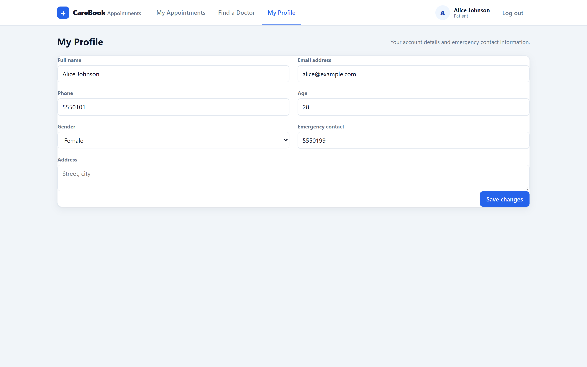

**Figure 3 — Patient profile:** editing contact details with a saved-changes toast.

**Module B — Doctor & Schedule Management**

| CRUD | Requirement | Endpoint |
| :--- | :--- | :--- |
| Create | Admin creates doctor account + profile (specialisation, qualification, fee, weekly blocks) | `POST /api/doctors` (admin) |
| Read | Search/filter by name, specialisation, weekday, fee ceiling; single profile; computed slot grid | `GET /api/doctors`, `GET /api/doctors/:id`, `GET /api/doctors/:id/slots?date=` |
| Update | Doctor edits own hours, fee, availability; admin edits names | `PATCH /api/doctors/:id` |
| Delete | Admin deactivates / reactivates (soft delete) | `PATCH /api/doctors/:id/status` |


**Figure 4 — Doctor directory:** search and filter by name, specialisation, weekday and fee, with schedule chips.

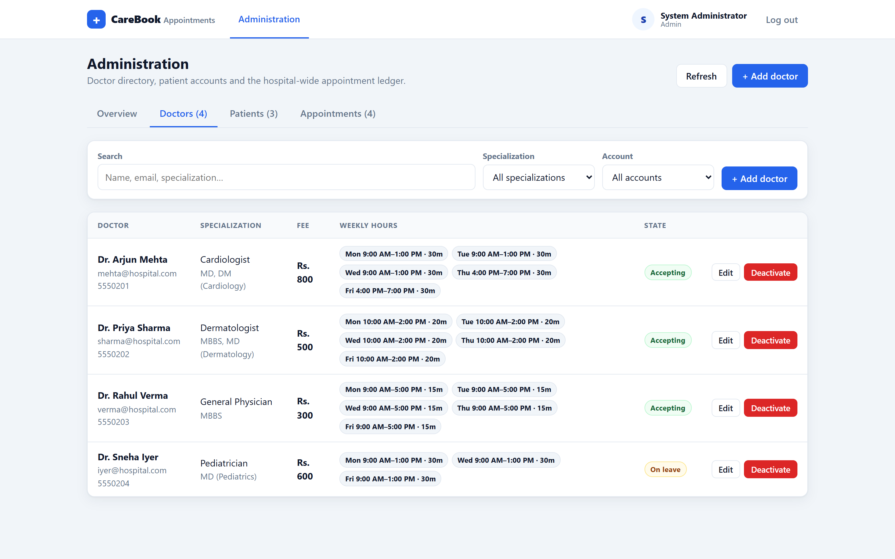

**Figure 5 — Administrator, doctor management:** create / edit / deactivate controls over the directory.

**Module C — Appointment Booking Lifecycle**

| CRUD | Requirement | Endpoint |
| :--- | :--- | :--- |
| Create | Patient selects doctor, date + computed slot, submits symptoms | `POST /api/appointments` |
| Read | Patient history; doctor day/week/month queue; admin ledger | `GET /api/appointments/my` · `/doctor` · `/appointments` |
| Update | Patient reschedules (→ Pending); doctor/admin drive lifecycle | `POST /:id/reschedule`, `PATCH /:id/status` |
| Delete | Cancel (releases slot); admin purges permanently | `POST /:id/cancel`, `DELETE /:id` |


**Figure 6 — Slot picker:** a computed slot grid from the doctor's weekly blocks; booked times are not offered.


**Figure 7 — Appointment history:** status tabs (All / Pending / Confirmed / Completed / Cancelled) and date filters.


**Figure 8 — Doctor day queue:** pending/confirmed rows with patient age / gender / phone and status actions.

**Module D — Consultation & Medical Notes**

| CRUD | Requirement | Endpoint |
| :--- | :--- | :--- |
| Create | Doctor attaches diagnosis, prescription, notes when completing | `PATCH /:id/status` + record fields |
| Read | Patient reads record for completed visits | `GET /api/appointments/my`, `GET /:id` |
| Update | Doctor edits record within 24 h of visit end (admin anytime) | `PATCH /:id/notes` |
| Delete | Admin purges duplicate / misfiled entries | `DELETE /:id` |

### 5.4 Non-Functional Requirements

**Table 2 — Non-Functional Requirements.**

| NFR | Requirement | Evidence |
| :--- | :--- | :--- |
| **Security** | bcrypt hashing (10 rounds), signed JWT, RBAC role gates, inactive-account blocks | `middleware/auth.js`, `utils/serialize.js` |
| **Performance** | Read-heavy endpoints served via optional read-through Redis cache (60 s TTL) | `utils/cache.js` |
| **Usability** | Responsive UI, toasts, confirm modals, skeleton loaders, realtime refresh | `context/ToastContext.jsx`, `components/Skeleton.jsx` |
| **Reliability** | Atomic slot check + partial unique index; fail-open optional services | `prisma/schema.prisma`, `src/db.js`, `services/*` |
| **Maintainability** | Layered architecture, pure domain module, single serializer contract | `src/domain/`, `src/utils/serialize.js` |
| **Testability** | Offline unit suite + full HTTP e2e suite in CI | `tests/` (21 + 72 assertions) |

---

## 6. Design & System Modeling

The design is captured as Mermaid models, embedded inline below. Sections 6.1–6.3
are the central UML views (use case, class, sequence); 6.4–6.6 add the data-flow,
entity-relationship, and architecture models; 6.7 details the database design.

### 6.1 Use Case Diagram

Actor boundaries for Patient, Doctor, and Administrator.

```mermaid
flowchart TD
  subgraph system["Hospital Appointment Booking System"]
    UC1["UC-01 Register / authenticate (JWT)"]
    UC2["UC-02 Browse & search doctor directory"]
    UC3["UC-03 View doctor schedule & available slots"]
    UC4["UC-04 Book an appointment slot"]
    UC5["UC-05 Reschedule / cancel own appointment"]
    UC6["UC-06 View own history & consultation records"]
    UC7["UC-07 Manage personal profile"]
    UC8["UC-08 View clinic queue (day / week / month)"]
    UC9["UC-09 Confirm / complete / cancel appointments"]
    UC10["UC-10 Write & edit consultation notes (24h window)"]
    UC11["UC-11 Record diagnosis, prescription, follow-up"]
    UC12["UC-12 Manage own schedule, fee, availability"]
    UC13["UC-13 Create / edit doctor profiles"]
    UC14["UC-14 Deactivate / reactivate doctors (soft delete)"]
    UC15["UC-15 Manage patient accounts"]
    UC16["UC-16 Browse & filter the appointment ledger"]
    UC17["UC-17 Correct / purge medical records"]
  end

  Patient --> UC1
  Patient --> UC2
  Patient --> UC3
  Patient --> UC4
  Patient --> UC5
  Patient --> UC6
  Patient --> UC7

  Doctor --> UC1
  Doctor --> UC8
  Doctor --> UC9
  Doctor --> UC10
  Doctor --> UC11
  Doctor --> UC12

  Administrator --> UC1
  Administrator --> UC13
  Administrator --> UC14
  Administrator --> UC15
  Administrator --> UC16
  Administrator --> UC17

  UC4 -.->|"«include»"| UC3
  UC9 -.->|"«include»"| UC8
```

**Figure 9 — Use Case Diagram:** actor boundaries for Patient, Doctor and Administrator, with `«include»` relations.

### 6.2 Class Diagram

The object model — entities, the `SlotBlock` value object, enumerations, and the
`AppointmentPolicy` domain service.

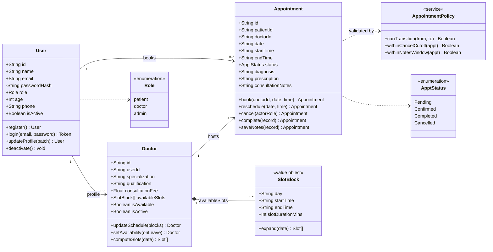

**Figure 10 — Class Diagram:** the domain object model, the `SlotBlock` value object, the enumerations, and the `AppointmentPolicy` service.

### 6.3 Sequence Diagram — Book an Appointment

The booking flow, showing validation, the free-slot check, the unique-index
guard, cache invalidation, and realtime/e-mail side effects. The remaining flows
(confirm/complete, cancel/reschedule, notes) follow the same request → validate →
persist → invalidate → notify pattern.

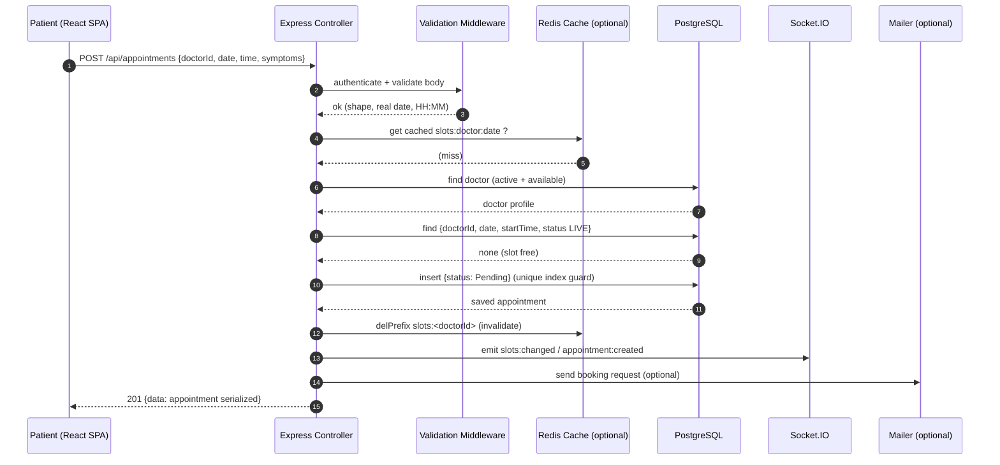

**Figure 11 — Sequence Diagram (Book an Appointment):** validation, the free-slot check, the unique-index guard, cache invalidation and fail-open side effects.

### 6.4 Data-Flow Diagrams

**DFD Level 0 (Context).** The booking engine is a single process; external
actors exchange data with it across the REST/WebSocket boundary, and the engine
owns the database and the optional cache.

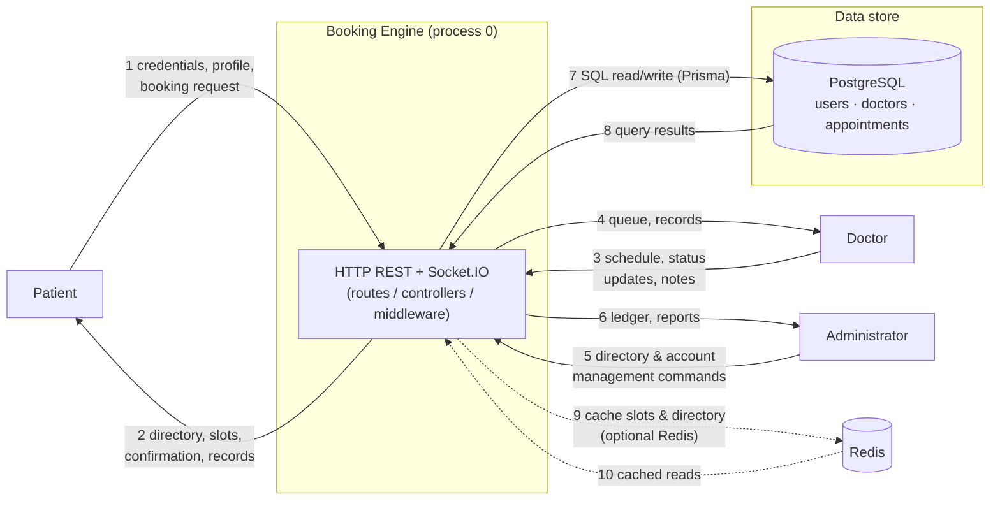

**Figure 12 — DFD Level 0 (Context):** every flow crosses authentication and validation middleware before touching the data store.

**DFD Level 1.** The engine decomposes into four processes; dashed arrows are the
optional cache, realtime push, and e-mail side effects.

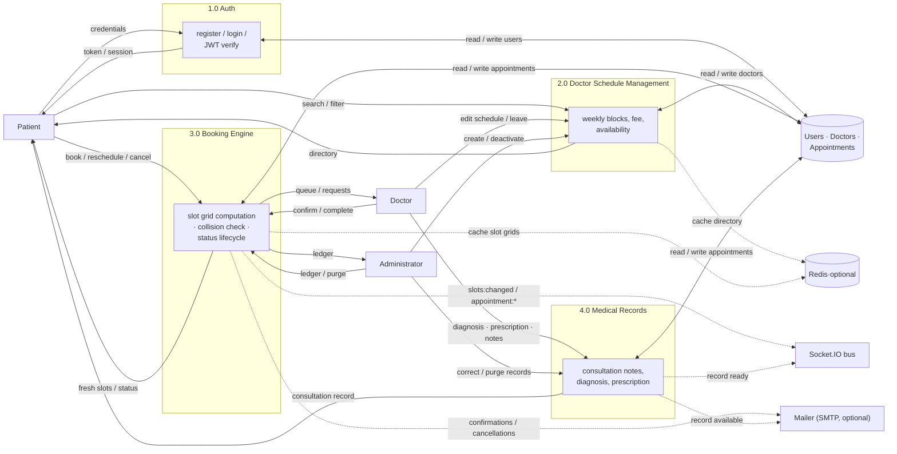

**Figure 13 — DFD Level 1:** Auth (1.0), Doctor Schedule (2.0), Booking Engine (3.0) and Medical Records (4.0), each reading and writing PostgreSQL through Prisma.

**DFD Level 2 (Booking Engine, process 3.0).** The sub-process that actually
prevents double-booking: validate → check availability → persist → notify.

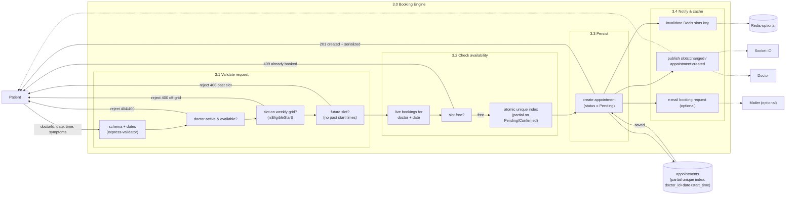

**Figure 14 — DFD Level 2 (Booking Engine):** the application check rejects a taken slot with `409`, and the partial unique index is the atomic backstop that makes the invariant true under a race.

### 6.5 Entity-Relationship Diagram

One `users` row per person; doctors have a linked `doctors` profile; every
appointment links a patient (`users`) to a doctor (`doctors`) through real
foreign keys.

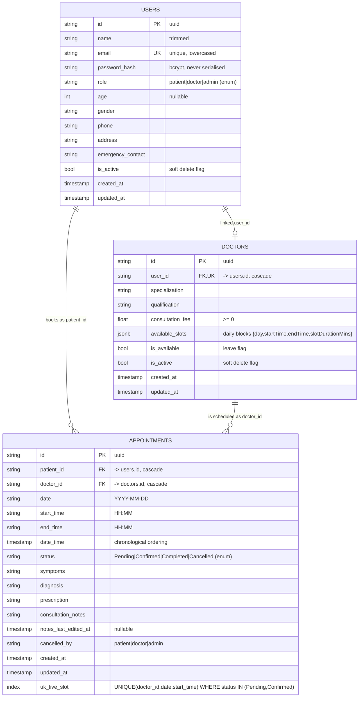

**Figure 15 — Entity-Relationship Diagram:** `users`, `doctors`, `appointments` with cardinality, foreign keys/cascades, and the partial unique slot index.

| Relationship | Cardinality | Notes |
| :--- | :--- | :--- |
| `users` ⟶ `doctors` | 1 : 0..1 | `doctors.user_id` is UNIQUE; a doctor account owns one profile |
| `users` (patient) ⟶ `appointments` | 1 : 0..N | `appointments.patient_id` FK → `users.id` (`ON DELETE CASCADE`) |
| `doctors` ⟶ `appointments` | 1 : 0..N | `appointments.doctor_id` FK → `doctors.id` (`ON DELETE CASCADE`) |
| Slot uniqueness | live appointments only | Cancelled/Completed rows fall outside the partial index → slot released |

### 6.6 Component Architecture

A component-level view of the running system: the browser SPA with its realtime
and HTTP clients, the Express API with JWT/RBAC-guarded route groups, the
controller and domain services, and the persistence & integration tier. It
complements the layered view in §7.1 by naming the actual modules and the calls
between them.

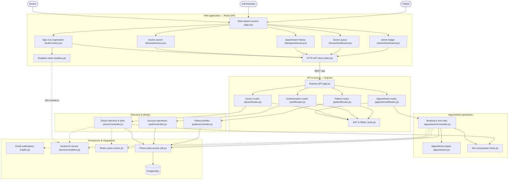

**Figure 16 — Component Architecture:** modules and the calls between them, from the SPA through the guarded API to the persistence & integration tier.

### 6.7 Database Design

Three PostgreSQL tables, defined once in
[`backend/prisma/schema.prisma`](../backend/prisma/schema.prisma):

**Table 3 — Database Tables.**

| Table | Purpose | Key columns |
| :--- | :--- | :--- |
| `users` | Credentials + profile for all roles | `name, email (unique), password_hash, role (enum), phone, is_active` |
| `doctors` | Directory + schedule, linked to a user | `user_id (unique FK), specialization, consultation_fee, available_slots (JSONB), is_available, is_active` |
| `appointments` | Bookings + consultation records | `patient_id FK, doctor_id FK, date, start_time, end_time, date_time, status (enum), diagnosis, prescription, consultation_notes, cancelled_by` |

**Concurrency design decision.** The `(doctor_id, date, start_time)` triple has
a *partial* unique index covering only `Pending` / `Confirmed` rows. Cancelling
an appointment therefore releases its slot automatically, and two simultaneous
requests for the same slot can never both succeed — the second receives a
unique-violation `409` (Prisma error `P2002`). Because Prisma cannot express a
partial index in its schema language, the index is created idempotently by
`backend/scripts/db-setup.js` during `npm run db:setup`:

```sql
CREATE UNIQUE INDEX IF NOT EXISTS appointments_live_slot_unique
ON appointments (doctor_id, date, start_time)
WHERE status IN ('Pending', 'Confirmed');
```

---

## 7. Implementation

### 7.1 Layered architecture

The backend follows a clean layered design so that each concern is isolated and
testable:

```
Request → Route → Auth/RBAC → Validation → Controller → Domain / Prisma → PostgreSQL
                                                     ↘ Serializer → JSON response
```

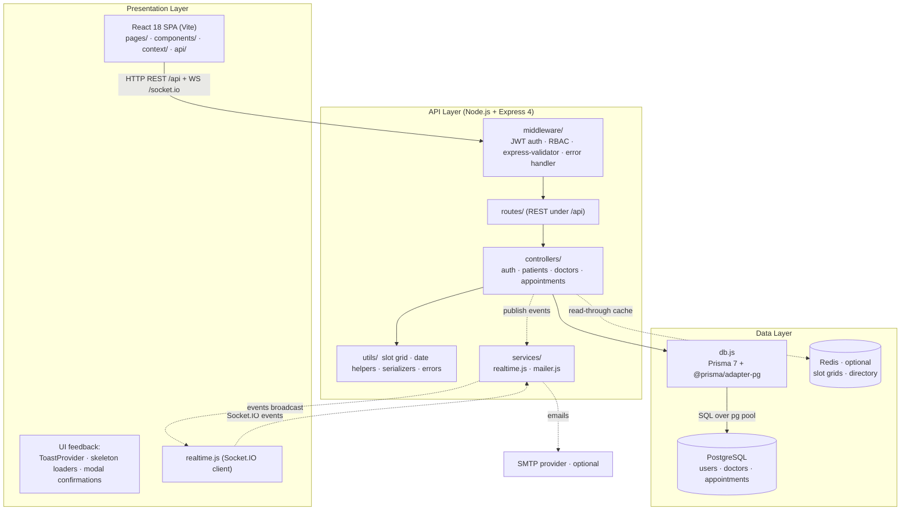

**Figure 17 — Layered Architecture:** presentation, API and data layers, with the optional (fail-open) Redis/Socket.IO/SMTP tiers.

The code is organised to mirror these layers:

```
backend/
  prisma/schema.prisma  PostgreSQL tables, enums, indexes
  prisma.config.ts      Prisma 7 config (DATABASE_URL, schema path)
  src/
    db.js             Prisma 7 client + pg driver adapter + slot-index bootstrap
    config/           env + policy knobs (cancel cutoff, notes window, cache TTL)
    domain/           appointment lifecycle state machine (pure, unit-tested)
    controllers/      auth, patients, doctors, appointments
    middleware/       auth (JWT + RBAC), validate (express-validator), errorHandler
    routes/           Express routers mounted under /api
    utils/            slot-grid & date helpers, serializers, UUID checks, cache
    services/         realtime (Socket.IO), mailer (Nodemailer)
  scripts/
    db-setup.js       creates the partial unique index Prisma cannot express
    seed.js           demo hospital (1 admin, 4 doctors, 3 patients, sample bookings)
```

### 7.2 The serializer contract

A single serializer (`utils/serialize.js`) governs the API's output shape:
`publicUser()` strips the password hash, `doctorSummary()` and
`appointmentSummary()` produce **flat** DTOs (e.g. `doctorName`,
`doctorConsultationFee`, `patientAge`) rather than nested database rows. This
single-contract approach keeps every client read site consistent and was the
key insight behind fixing the migration bug described in §9.

### 7.3 Security implementation

- **Passwords** — bcrypt, 10 salt rounds; the hash is stripped by `publicUser()`
  before any row leaves the API (verified by e2e `SEC-03`).
- **Sessions** — signed JWT (`HS256`), 7-day expiry, Bearer header; `requireAuth`
  reloads the user and blocks deactivated accounts.
- **RBAC** — `requireRole('patient' | 'doctor' | 'admin')` layered on
  `requireAuth`; all cross-role cases asserted in e2e (`SEC-06 … SEC-17`).
- **Validation** — express-validator chains on every POST/PATCH, with nested
  rules for doctor weekly blocks; uniform `400 { error, details[] }` shape.
- **Concurrency** — partial unique index backstop (§6.7), proven by a real
  two-request race test.

### 7.4 Optional-service wiring (fail-open)

- **Redis cache** — `getJSON/setJSON/delPrefix` become no-ops when `REDIS_URL` is
  unset; directory and slot grids are cached per query signature and invalidated
  on every relevant write.
- **Socket.IO** — JWT-verified handshake; mutations publish lightweight
  `slots:changed` / `appointment:*` triggers; clients refetch via REST.
- **Nodemailer** — transport built only when configured; otherwise messages log
  to the console and are skipped.

---

## 8. Testing

Testing combines an **offline unit suite** and a **full HTTP end-to-end suite**,
backed by a documented black-box matrix, equivalence partitioning, and
boundary-value analysis in
[`backend/tests/TEST_MATRIX.md`](../backend/tests/TEST_MATRIX.md).

### 8.1 Types of testing performed

**Table 4 — Types of Testing Performed.**

| Type | Level | Tool | What it proves |
| :--- | :--- | :--- | :--- |
| **Unit testing** | Pure functions | Node built-in test runner (`node --test`) | Slot-grid expansion, date validation, lifecycle state machine — no I/O, no database |
| **Integration / E2E** | HTTP + database | Custom Node harness (`tests/e2e/api.e2e.js`) | Real routing, middleware, Prisma and PostgreSQL over live HTTP |
| **Regression** | Concurrency | Two simultaneous requests for one slot | The partial unique index holds under a genuine race |
| **Security testing** | RBAC / authz | Negative e2e cases `SEC-01 … SEC-17` | Unauthorised and cross-role access always returns 401/403/404 |
| **Validation testing** | Boundary | express-validator chains | Malformed, out-of-range and past-date input is rejected uniformly |
| **Build / smoke** | Production bundle | `vite build` + `/api/health` probe | The artefact compiles and the API boots cleanly |
| **Continuous testing** | CI | GitHub Actions | All of the above on every push and pull request |

### 8.2 Test cases and results

**Table 5 — Test Cases and Results.**

| Suite | Command | Coverage | Result |
| :--- | :--- | :--- | :--- |
| Unit (offline) | `npm test` | Slot-grid maths, date validation, lifecycle state machine | **21 / 21 pass** |
| End-to-end | `npm run test:e2e` | Auth, RBAC (14 negative cases), directory & filters, slots, double-booking + race, lifecycle & 24 h window, cutoff, reschedule, purge, profile CRUD, registration — against PostgreSQL | **72 / 72 pass** |
| Build | `npm run build` (frontend) | Production Vite bundle | passes |

**Highlight assertions**

- **TC-13** — two concurrent HTTP requests for one slot: exactly one `201`, the
  other `409` (unique-index backstop).
- **TC-21 / TC-22** — the 24-hour notes window and 2-hour cancellation cutoff are
  exercised by back-dating rows through Prisma ("time travel"), so no real
  waiting is needed.
- **SEC-01 … SEC-17** — every unauthorised-access class returns `401/403/404` as
  specified, including role-escalation attempts.

**Test-design techniques**

- *Equivalence partitioning* — e.g. booking date {valid future day | past day |
  impossible day `2026-02-30` | malformed}.
- *Boundary-value analysis* — password length 6 vs 5; cutoff exactly at 2 h;
  notes window exactly at 24 h; leap-February calendar days.

The same suites run automatically in CI on every push
([`.github/workflows/main.yml`](../.github/workflows/main.yml)).

---

## 9. Observations & Discussion

### 9.1 Results achieved

Every requirement in §5 is implemented and verified by an automated assertion, and
the pipeline is green on `main`. The final measured state:

| Metric | Result |
| :--- | :--- |
| Automated assertions | **93 passing** (21 unit + 72 end-to-end) |
| Modules delivered with full CRUD | 4 (Patients, Doctors & Schedules, Appointments, Consultation Records) |
| UML / CASE artefacts | Use case, class, sequence, DFD L0–L2, ERD, component & layered architecture |
| Role-separated dashboards | Patient, Doctor, Administrator |
| CI status on `main` | Green — schema, seed, unit, e2e and production build all pass |

The administrator console gives hospital-wide oversight over the whole dataset —
statistics, accounts, and the appointment ledger:


**Figure 18 — Administrator overview:** statistics cards (totals, today, non-zero revenue, status split).

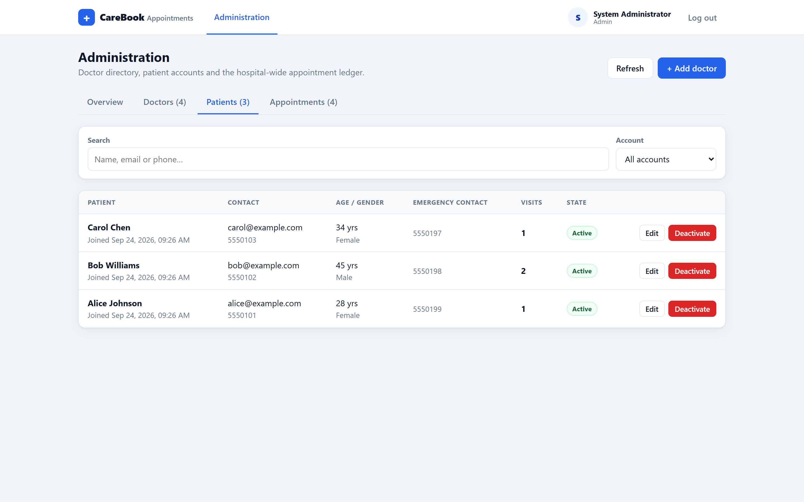

**Figure 19 — Administrator, patient accounts:** account list with edit and (soft) deactivate actions.


**Figure 20 — Administrator, appointment ledger:** the hospital-wide ledger with filters and a populated consultation-fee column.

Additional screenshots of every patient and doctor journey are embedded in §5.3.

### 9.2 Challenges faced

- **Concurrency vs. the slot model.** The first instinct was an application-level
  "is this slot free?" query. That produces a friendly message but cannot survive a
  genuine race — two requests can both read "free" before either writes. Solving it
  properly required moving the invariant into the database as a *partial* unique
  index, which Prisma's schema language cannot express, so a raw-SQL bootstrap step
  was needed.
- **A database migration under a live API.** Moving from MongoDB/Mongoose to
  PostgreSQL/Prisma changed the response shape from nested, populated objects to
  flat DTOs. Frontend read sites still expected the old nesting (e.g.
  `a.doctorId.consultationFee` where `doctorId` is now a bare id), so the admin
  revenue KPI silently rendered `Rs. 0` and the doctor queue lost patient
  age/gender/phone. Nothing threw — it degraded quietly, which is the dangerous
  failure mode.
- **Time-based rules are hard to test honestly.** A 2-hour cancellation cutoff and a
  24-hour notes window cannot be validated by waiting. The suite instead back-dates
  rows through Prisma ("time travel") so the exact boundaries can be probed.
- **A green local run that was red in CI.** The suite passed locally for months but
  failed every CI run. The cause was a genuine runtime difference, not flakiness:
  `node --test` only gained glob support in Node 21, while CI pins Node 20, which
  treated the glob as a literal filename. Fixing it properly meant verifying the
  runner behaviour against real Node 20 *and* Node 24 binaries rather than trusting
  one environment.

### 9.3 Insights

- **Concurrency is best solved at the database.** The application check exists only
  to produce a good error message; the partial unique index is what actually makes
  the invariant true. Verified by a real two-request race, not by reasoning.
- **A single serializer contract prevents whole classes of bugs.** Routing every
  response through one `utils/serialize.js` is what made the migration bug
  *findable* — there was exactly one place to fix. The contract must live in one
  place or it will drift.
- **Fail-open integrations keep the core deterministic.** Redis, Socket.IO and
  Nodemailer each degrade to a no-op, so local setup and grading stay reproducible
  while still demonstrating production-shaped patterns.
- **Knowing when to leave the ORM is a design skill.** The one constraint Prisma
  could not model was handled with a small, idempotent raw-SQL step rather than by
  contorting the schema.
- **CI is a different machine from your laptop.** The pipeline should be treated as
  the source of truth; a feature is not finished until CI is green.

### 9.4 Improvements for future work

- **Online payment and insurance claims** tied to the `Completed` appointment state.
- **Full-text search and faceted filtering** (specialisation, fee band, language,
  rating) over a growing doctor directory.
- **Push/email reminders** one day and one hour before an appointment, using the
  existing fail-open mailer tier.
- **Audit-log screens** for admin so record corrections and purges are reviewable
  rather than only auditable in the database.
- **Refresh-token sessions and role-level rate limiting** for a production threat
  model.
- **Containerisation** (`docker compose` for API, web and database) so a reviewer
  can run the whole system with a single command.

---

## 10. Conclusion

A production-shaped hospital appointment booking system was architected,
implemented, and verified end to end on a PostgreSQL foundation. The project
exercises the complete software-engineering lifecycle: requirement capture and
modelling (use cases, class diagram, DFD L0–L2, ERD, sequence diagrams), schema
design with a concurrency-safe partial unique index, a layered REST
implementation with JWT/RBAC and request validation, an optional
performance/realtime/notification tier that is fail-open by design, and
automated black-box verification with **93 passing assertions** (21 unit + 72
end-to-end) wired into a CI pipeline.

### Learning outcomes

- Turning a business rule ("a slot cannot be double-booked") into a *database
  constraint* plus an application check, and proving it under concurrency.
- Modelling a relational schema with real foreign keys, enums, and cascades —
  and recognising the one constraint the ORM cannot express.
- Designing state machines (lifecycle transitions, cancellation cutoff, notes
  window) and making them testable with time-travel fixtures.
- Layering authentication and authorisation — JWT sessions, RBAC gates,
  ownership checks — and verifying each with negative tests.
- Maintaining a single serializer/DTO contract across a database migration, and
  the debugging discipline that surfaces when that contract drifts.
- Using CASE notation (use case, class, sequence, DFD, ERD) *before* writing
  code, so the models drove the schema and the API surface rather than
  documenting them afterwards.
- Learning that continuous integration is a genuine engineering tool: the
  Node 20 vs Node 24 discrepancy proved that "works on my machine" is a
  hypothesis to be tested, not a conclusion.

---

## References

1. Node.js Foundation. *Node.js Documentation.* <https://nodejs.org/docs>
2. OpenJS Foundation. *Express 4 Guide.* <https://expressjs.com>
3. Meta Open Source. *React Documentation.* <https://react.dev>
4. Vite. *Vite Guide.* <https://vite.dev>
5. PostgreSQL Global Development Group. *PostgreSQL 16 Documentation.* <https://www.postgresql.org/docs/16/>
6. Prisma. *Prisma ORM Documentation.* <https://www.prisma.io/docs>
7. Socket.IO. *Socket.IO Documentation.* <https://socket.io/docs/v4/>
8. Auth0. *JSON Web Tokens (jsonwebtoken).* <https://github.com/auth0/node-jsonwebtoken>
9. express-validator. *Documentation.* <https://express-validator.github.io>

---

*Repository: `Mugetsu-1/Hospital-Booking-System`. See [`README.md`](../README.md)
for setup and [`backend/tests/TEST_MATRIX.md`](../backend/tests/TEST_MATRIX.md)
for the full QA matrix.*
