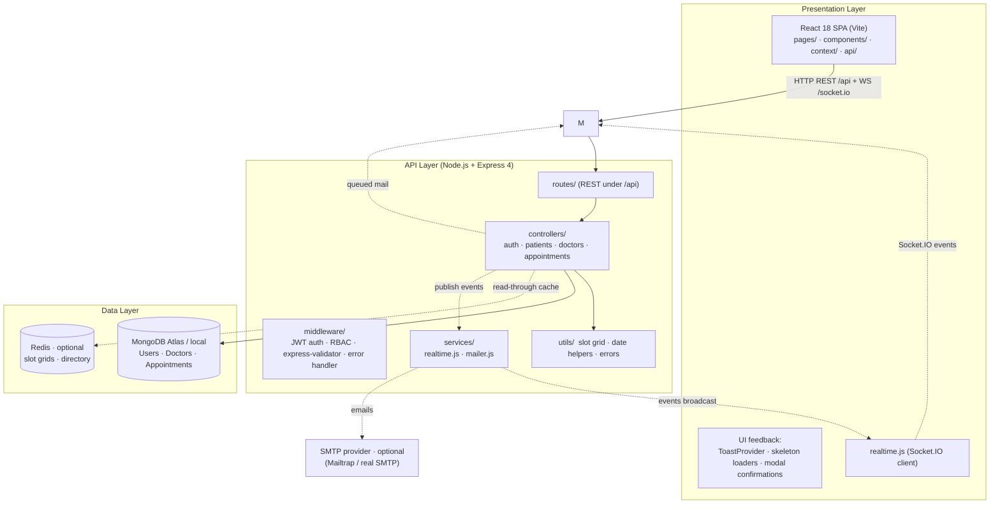

# System Architecture

Layered architecture with a React SPA, an Express REST API, MongoDB, and three
**optional** companion services (Redis, Socket.IO, Nodemailer). Optional layers
are fail-open — the application runs identically when they are not configured.

## Stack matrix (as implemented)

| Layer | Technology | Responsibility |
| :--- | :--- | :--- |
| Frontend | React 18, Vite 5, React Router 6, Axios | SPA, client state via React context, route guards |
| API | Node.js, Express 4 | REST controllers, JWT auth, RBAC, validation |
| Data | MongoDB + Mongoose 8 | `Users`, `Doctors`, `Appointments` documents |
| Cache | Redis (optional) | Read-through cache for doctor lists & slot grids |
| Realtime | Socket.IO (optional) | `slots:changed`, `appointment:*` triggers |
| Notifications | Nodemailer (optional) | Booking/reschedule/cancel/status/notes e-mails |
| CI/CD | GitHub Actions | Lint, unit tests, production build on push/PR |

## Optional-layer behaviour

| Layer | Enabled when | When disabled |
| :--- | :--- | :--- |
| Redis | `REDIS_URL` set | Reads query MongoDB directly — same responses |
| Socket.IO | always mounted | clients auto-fallback to REST polling |
| Nodemailer | `MAIL_ENABLED=true` + SMTP host/from | mail calls log and skip; booking flow unaffected |