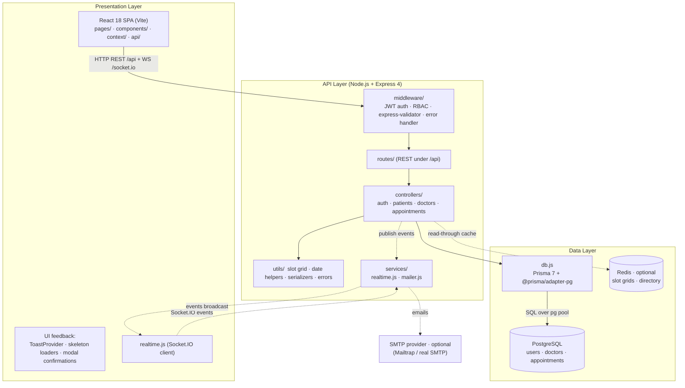

# System Architecture

Layered architecture with a React SPA, an Express REST API, a local
PostgreSQL database, and three **optional** companion services (Redis,
Socket.IO, Nodemailer). Optional layers are fail-open — the application runs
identically when they are not configured.

```mermaid
flowchart TB
  subgraph presentation["Presentation Layer"]
    FE["React 18 SPA (Vite)\npages/ · components/ · context/ · api/"]
    UI["UI feedback:\nToastProvider · skeleton loaders · modal confirmations"]
    RT["realtime.js (Socket.IO client)"]
  end

  subgraph api["API Layer (Node.js + Express 4)"]
    R["routes/  (REST under /api)"]
    MW["middleware/\nJWT auth · RBAC · express-validator · error handler"]
    C["controllers/\nauth · patients · doctors · appointments"]
    U["utils/  slot grid · date helpers · serializers · errors"]
    S["services/\nrealtime.js · mailer.js"]
  end

  subgraph data["Data Layer"]
    DB[(PostgreSQL\nusers · doctors · appointments)]
    PRISMA["db.js\nPrisma 7 + @prisma/adapter-pg"]
    CACHE[(Redis · optional\nslot grids · directory)]
  end

  EMAIL["SMTP provider · optional\n(Mailtrap / real SMTP)"]

  FE -->|"HTTP REST /api + WS /socket.io"| MW
  RT -.->|"Socket.IO events"| S
  MW --> R
  R --> C
  C --> U
  C --> PRISMA
  PRISMA -->|"SQL over pg pool"| DB
  C -.->|"read-through cache"| CACHE
  C -.->|"publish events"| S
  S -.->|"events broadcast"| RT
  S -.->|"emails"| EMAIL
```

## Stack matrix (as implemented)

| Layer | Technology | Responsibility |
| :--- | :--- | :--- |
| Frontend | React 18, Vite 5, React Router 6, Axios | SPA, client state via React context, route guards |
| API | Node.js, Express 4 | REST controllers, JWT auth, RBAC, validation |
| Data | PostgreSQL + Prisma 7 (`@prisma/adapter-pg`) | Relational `users`, `doctors`, `appointments` tables |
| Cache | Redis (optional) | Read-through cache for doctor lists & slot grids |
| Realtime | Socket.IO (optional) | `slots:changed`, `appointment:*` triggers |
| Notifications | Nodemailer (optional) | Booking/reschedule/cancel/status/notes e-mails |
| CI | GitHub Actions | Schema push, seed, unit tests, e2e API suite, production build |

## Optional-layer behaviour

| Layer | Enabled when | When disabled |
| :--- | :--- | :--- |
| Redis | `REDIS_URL` set | Reads query PostgreSQL directly — same responses |
| Socket.IO | always mounted | clients auto-fallback to REST polling |
| Nodemailer | `MAIL_ENABLED=true` + SMTP host/from | mail calls log and skip; booking flow unaffected |
