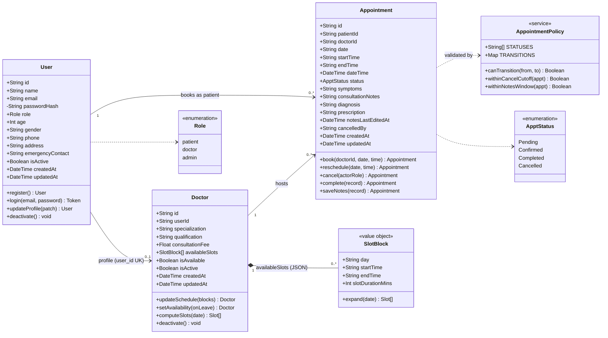

# UML Class Diagram

A design-level class model of the Hospital Doctor Appointment Booking System.
It is derived directly from the persistent entities in
[`backend/prisma/schema.prisma`](../backend/prisma/schema.prisma) and the
lifecycle rules in
[`backend/src/domain/appointment.js`](../backend/src/domain/appointment.js).
Where the ERD ([`erd.md`](./erd.md)) shows the **relational tables**, this
diagram shows the **object model**: entity attributes with visibility, the
value object behind the `available_slots` JSON column, the enumerations, and
the domain service that guards the appointment state machine.

## How the model maps to code

| Class | Kind | Source |
| :--- | :--- | :--- |
| `User` | Entity (table `users`) | `schema.prisma` · `controllers/authController.js`, `patientController.js` |
| `Doctor` | Entity (table `doctors`) | `schema.prisma` · `controllers/doctorController.js` |
| `Appointment` | Entity (table `appointments`) | `schema.prisma` · `controllers/appointmentController.js` |
| `SlotBlock` | Value object (inside `doctors.available_slots` JSON) | `utils/slots.js` (`expandBlock`) |
| `AppointmentPolicy` | Domain service (pure, testable offline) | `domain/appointment.js` + `config.policies` |
| `Role`, `ApptStatus` | Enumerations | `schema.prisma` (`enum Role`, `enum ApptStatus`) |

## Design notes

- **`passwordHash` is private (`-`)** and is stripped from every response by
  `publicUser()` in [`utils/serialize.js`](../backend/src/utils/serialize.js);
  it never crosses the API boundary.
- **`SlotBlock` is a composition** (filled diamond): the weekly working blocks
  have no identity of their own and live inside the owning `Doctor` row as a
  JSON array. `Doctor.computeSlots(date)` fans each block out into concrete
  bookable slots for a given calendar day.
- **`AppointmentPolicy` centralises the state machine.** The legal moves are
  `Pending → Confirmed → Completed` (with `Cancelled` reachable from either
  live state); `canTransition()` rejects everything else, including the
  `Cancelled → Completed` edge (TC-04/TC-16). The time-window guards
  (`withinCancelCutoff`, `withinNotesWindow`) read the thresholds from
  `config.policies` (2 h cancel cutoff, 24 h notes-edit window).
- **The methods are behavioural, not literal.** Prisma models are data records;
  the operations shown here are implemented as controller handlers over those
  records (e.g. `Appointment.book()` = `POST /api/appointments`). They are
  listed on the owning class to document responsibility.
