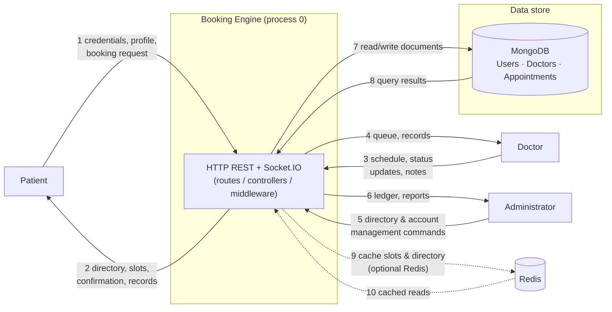

# DFD Level 0 — Context Diagram

The booking engine is a single process. External actors exchange data with it
through the REST/WebSocket boundary; the engine owns the database and the
optional cache.

## Data flow glossary

| # | Flow | Content |
| :--- | :--- | :--- |
| 1 | Patient → Engine | JWT login/register, profile edits, date+doctor+slot booking, reschedule/cancel |
| 2 | Engine → Patient | Doctor directory, computed available slots, appointment status, consultation records |
| 3 | Doctor → Engine | Weekly work blocks, `isAvailable` toggle, status transitions, diagnosis/prescription/notes |
| 4 | Engine → Doctor | Day/week/month queue, patient summaries, record edit window state |
| 5 | Admin → Engine | Doctor create/update/deactivate, patient account management, record purge |
| 6 | Engine → Admin | Hospital-wide appointment ledger, filters by status/doctor/patient/date |
| 7/8 | Engine ↔ MongoDB | CRUD on `Users`, `Doctors`, `Appointments` collections |
| 9/10 | Engine ↔ Redis (optional) | Read-through cache of doctor lists and slot grids; prefix-invalidated on writes |

The single process boundary means every flow crosses authentication +
validation middleware before touching the data store.