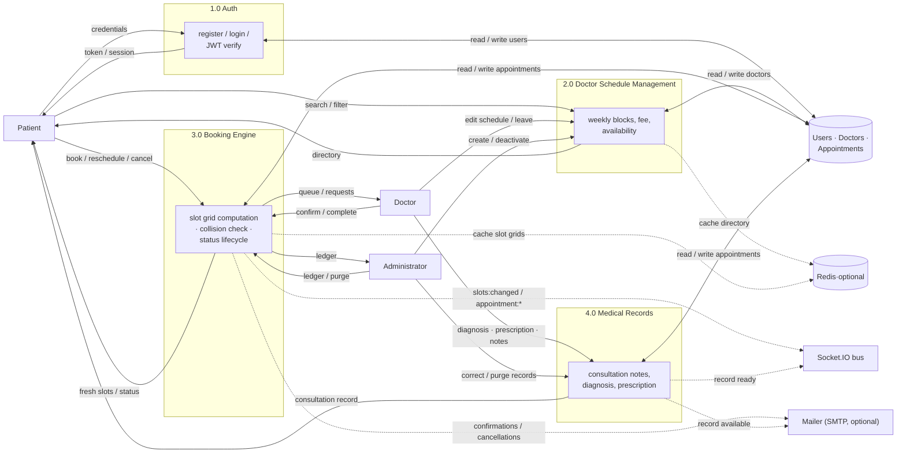

# DFD Level 1

The booking engine decomposes into four processes. Arrows show data movement;
dashed arrows are optional (cache, realtime push, e-mail side effects).

## Process responsibilities

| Process | Responsibility | Controllers / services |
| :--- | :--- | :--- |
| 1.0 Auth | Register/login, JWT issue/verify, RBAC role gates | `controllers/auth.js`, `middleware/auth.js` |
| 2.0 Doctor Schedule | Directory CRUD, weekly blocks, leave flag, fee | `controllers/doctor.js`, `models/Doctor.js` |
| 3.0 Booking Engine | Slot computation, double-booking protection, lifecycle transitions | `controllers/appointment.js`, `utils/slots.js`, `models/Appointment.js` |
| 4.0 Medical Records | Consultation notes, diagnosis, prescription, 24h edit window, purge | `controllers/appointment.js` (notes/status) |

Data store: MongoDB collections `Users`, `Doctors`, `Appointments`.