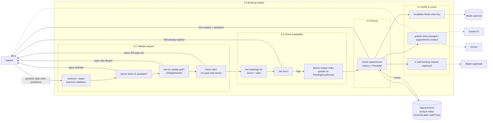

# DFD Level 2 — Booking Engine (process 3.0)

Deconstructs `3.0 Booking Engine` into atomic slot validation and database
persistence. This is the process that prevents double-booking.

## Concurrency guarantee

The same `(doctorId, date, startTime)` cannot be held by two **live**
appointments (Pending/Confirmed). Two layers enforce it:

1. **Application check** (`assertSlotFree`) — rejects a booked slot with 409.
2. **Partial unique index** on `Appointments` —
   `{ doctorId: 1, date: 1, startTime: 1 }` unique where
   `status ∈ { Pending, Confirmed }`. The moment an appointment is Cancelled it
   leaves the index and the slot returns to the pool (see `models/Appointment.js`).

The e2e suite proves both layers with a genuine two-request race for a single
slot (`TC-13`), and the returned-slot re-booking flows (`TC-24`, `TC-25`).