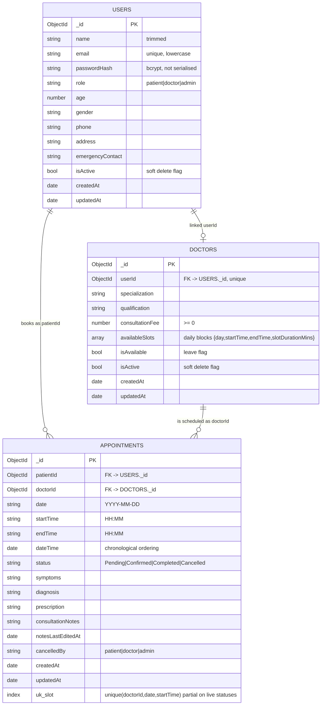

# Entity-Relationship Diagram (MongoDB)

One `Users` document per person; doctors have a linked `Doctors` profile; every
appointment links a patient (via `Users`) to a doctor (via `Doctors`).

## Relationships & integrity rules

| Relationship | Cardinality | Notes |
| :--- | :--- | :--- |
| `Users` ⟶ `Doctors` | 1 : 0..1 | `Doctor.userId` is unique; a doctor account owns one profile |
| `Users` (patient) ⟶ `Appointments` | 1 : 0..N | `Appointment.patientId` references `Users._id` |
| `Doctors` ⟶ `Appointments` | 1 : 0..N | `Appointment.doctorId` references `Doctors._id` |
| Slot uniqueness | live appointments only | Cancelled rows drop out → slot released |

Because Mongo stores documents, "foreign keys" are `ObjectId` references
resolved with `.populate()` in the controllers (`POPULATE_DOCTOR`,
`POPULATE_PATIENT`).