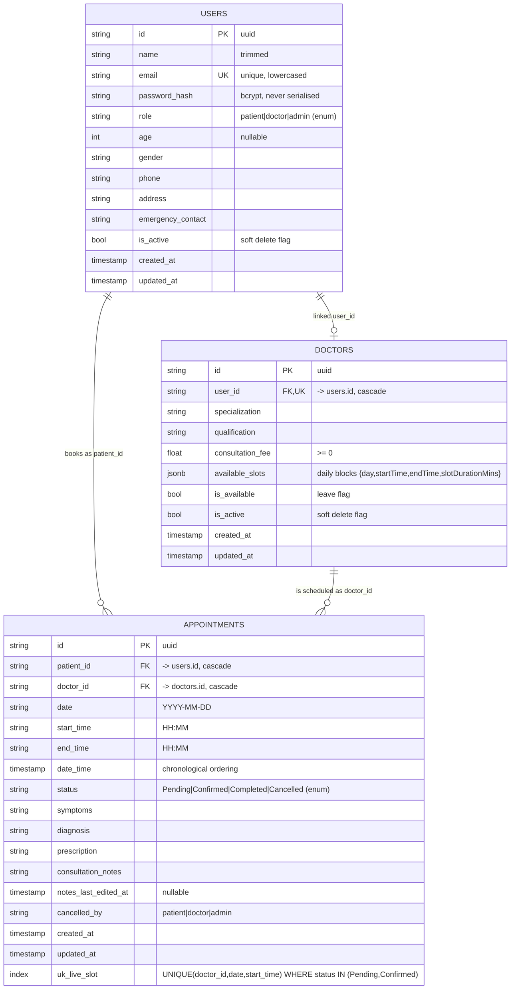

# Entity-Relationship Diagram (PostgreSQL)

One `users` row per person; doctors have a linked `doctors` profile; every
appointment links a patient (`users`) to a doctor (`doctors`) through real
foreign keys. The schema is defined once in
[`backend/prisma/schema.prisma`](../backend/prisma/schema.prisma) and applied
with `prisma db push` to a local PostgreSQL server.


```mermaid
erDiagram
  USERS ||--o{ APPOINTMENTS : "books as patient_id"
  DOCTORS ||--o{ APPOINTMENTS : "is scheduled as doctor_id"
  USERS ||--o| DOCTORS : "linked user_id"

  USERS {
    string id PK "uuid"
    string name "trimmed"
    string email UK "unique, lowercased"
    string password_hash "bcrypt, never serialised"
    string role "patient|doctor|admin (enum)"
    int age "nullable"
    string gender
    string phone
    string address
    string emergency_contact
    bool is_active "soft delete flag"
    timestamp created_at
    timestamp updated_at
  }

  DOCTORS {
    string id PK "uuid"
    string user_id FK,UK "-> users.id, cascade"
    string specialization
    string qualification
    float consultation_fee ">= 0"
    jsonb available_slots "daily blocks {day,startTime,endTime,slotDurationMins}"
    bool is_available "leave flag"
    bool is_active "soft delete flag"
    timestamp created_at
    timestamp updated_at
  }

  APPOINTMENTS {
    string id PK "uuid"
    string patient_id FK "-> users.id, cascade"
    string doctor_id FK "-> doctors.id, cascade"
    string date "YYYY-MM-DD"
    string start_time "HH:MM"
    string end_time "HH:MM"
    timestamp date_time "chronological ordering"
    string status "Pending|Confirmed|Completed|Cancelled (enum)"
    string symptoms
    string diagnosis
    string prescription
    string consultation_notes
    timestamp notes_last_edited_at "nullable"
    string cancelled_by "patient|doctor|admin"
    timestamp created_at
    timestamp updated_at
    index uk_live_slot "UNIQUE(doctor_id,date,start_time) WHERE status IN (Pending,Confirmed)"
  }
```

## Relationships & integrity rules

| Relationship | Cardinality | Notes |
| :--- | :--- | :--- |
| `users` ⟶ `doctors` | 1 : 0..1 | `doctors.user_id` is UNIQUE; a doctor account owns one profile |
| `users` (patient) ⟶ `appointments` | 1 : 0..N | `appointments.patient_id` FK → `users.id` (`ON DELETE CASCADE`) |
| `doctors` ⟶ `appointments` | 1 : 0..N | `appointments.doctor_id` FK → `doctors.id` (`ON DELETE CASCADE`) |
| Slot uniqueness | live appointments only | Cancelled/Completed rows fall outside the partial index → slot released |

Referential integrity is enforced by the database (foreign keys + cascades),
not by application code. The one constraint PostgreSQL expresses better than
Prisma's schema language — the partial unique slot index — is created by
`scripts/db-setup.js`:

```sql
CREATE UNIQUE INDEX IF NOT EXISTS appointments_live_slot_unique
ON appointments (doctor_id, date, start_time)
WHERE status IN ('Pending', 'Confirmed');
```
