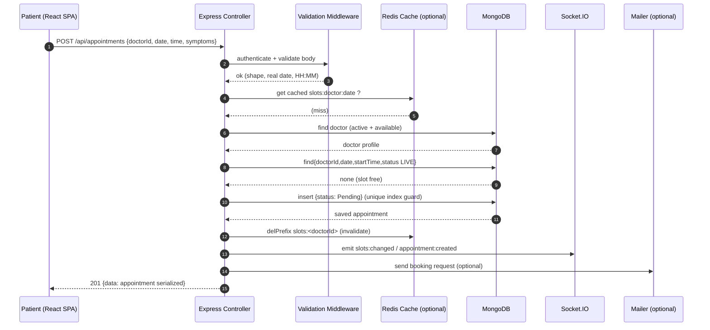
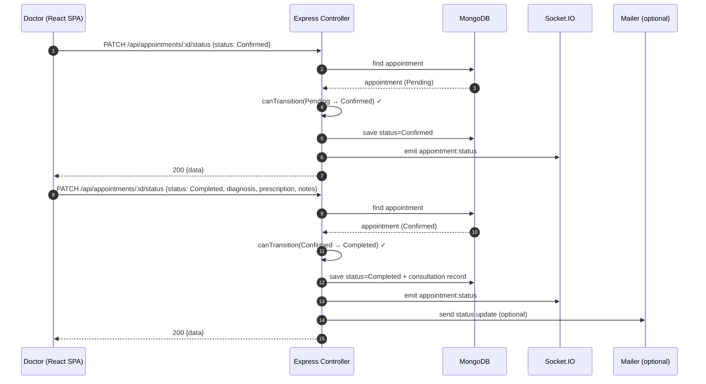
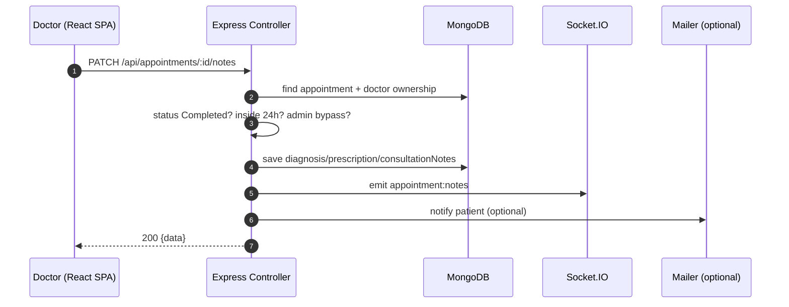

# Sequence Diagrams

## 1. Book an appointment (patient)



## 2. Confirm + complete a consultation (doctor)



## 3. Cancel / reschedule (patient) — slot release

```mermaid
sequenceDiagram
  autonumber
  participant P as Patient (React SPA)
  participant C as Express Controller
  participant R as Redis Cache (optional)
  participant D as MongoDB
  participant S as Socket.IO
  participant M as Mailer (optional)

  P->>C: POST /api/appointments/:id/cancel
  C->>D: find appointment (owned?)
  D-->>C: appointment
  C->>C: cutoff check (≥2h before start)
  C->>D: save status=Cancelled
  C->>R: delPrefix slots:doctorId
  C->>S: emit slots:changed, appointment:updated
  C->>M: send cancellation notice (optional)
  C-->>P: 200 {message, data}

  P->>C: POST /api/appointments/:id/reschedule {date, time}
  C->>D: find appointment; assertSlotFree(new slot, exclude self)
  C->>D: save new date/time, status=Pending
  C->>R: invalidate both slot keys
  C->>S: emit slot/appointment change
  C-->>P: 200 {data}
```

## 4. Write consultation notes (24h window)



Every request crosses `requireAuth` (JWT) and the role/ownership guard before
reaching persistence — the RBAC facts from `middleware/auth.js` apply to all
four flows.