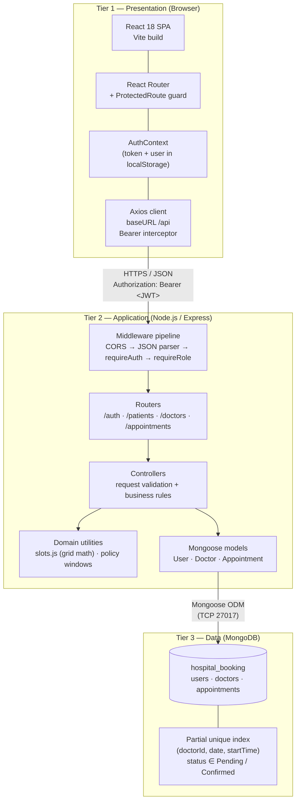
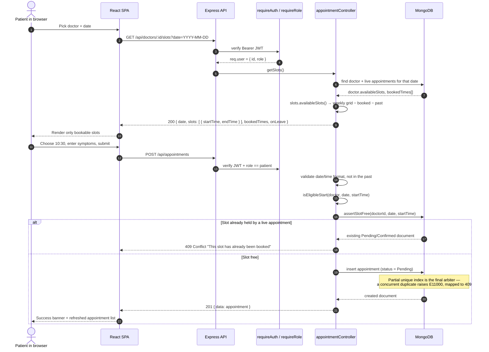
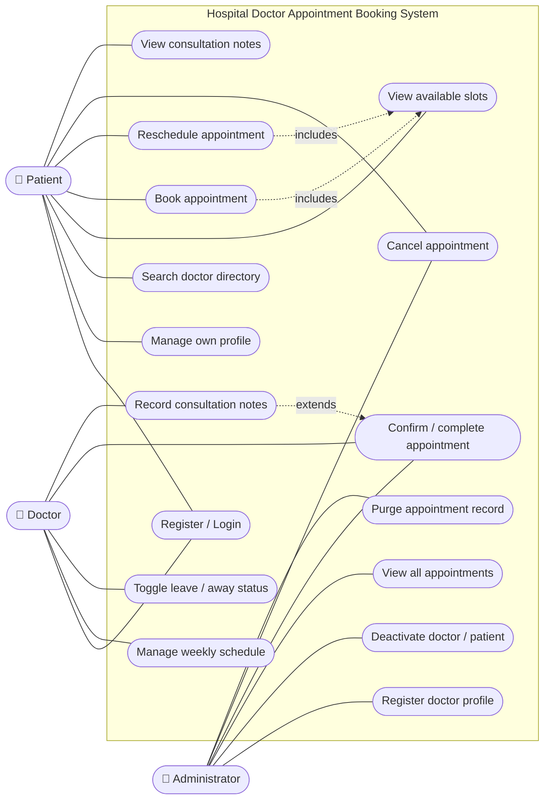
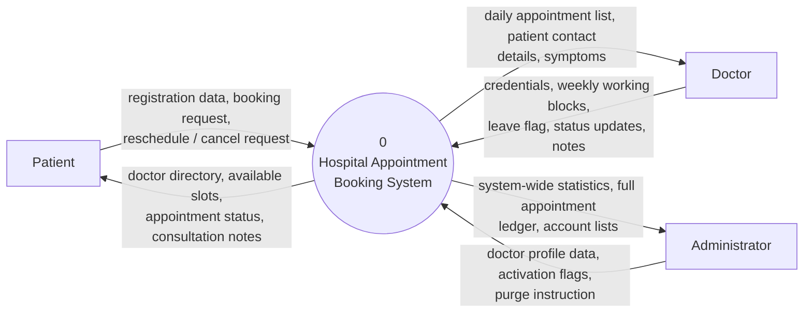
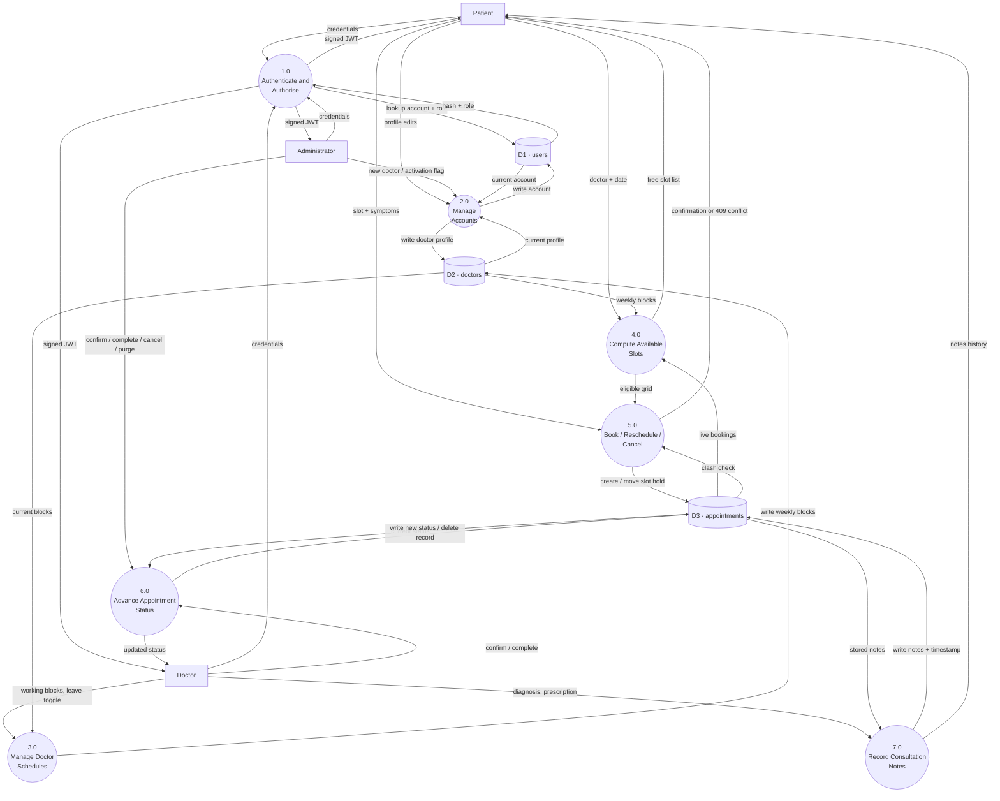
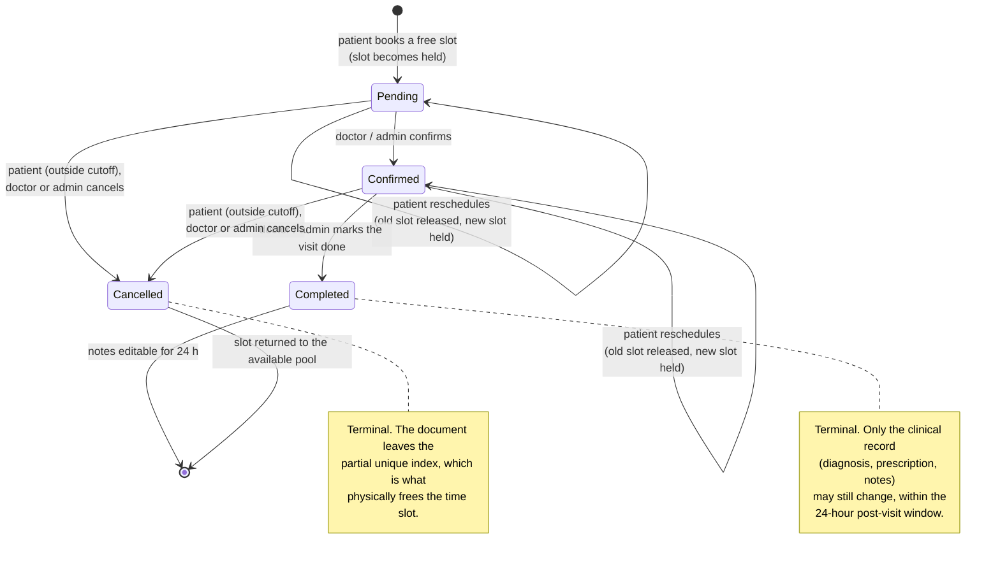
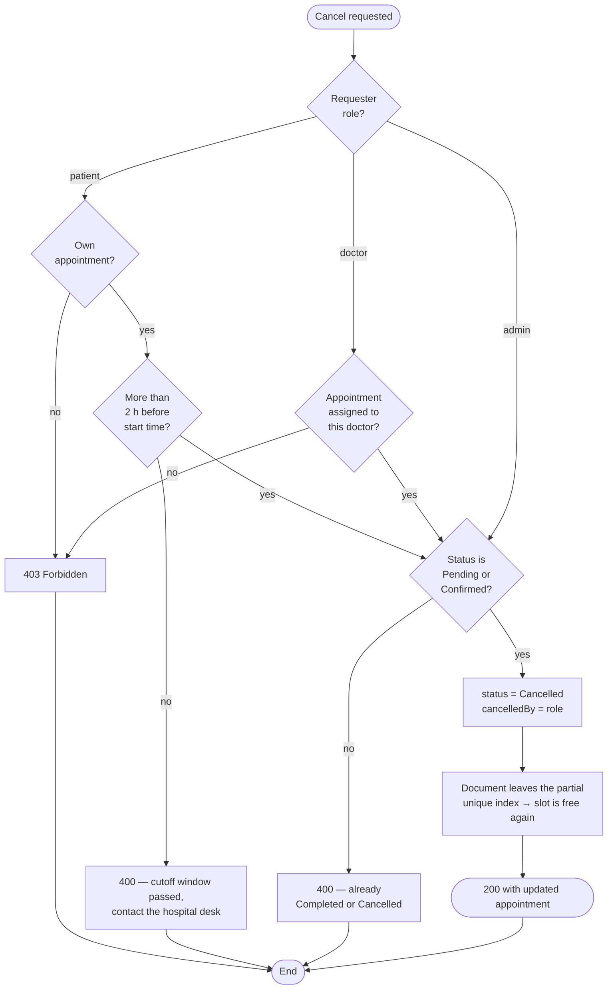
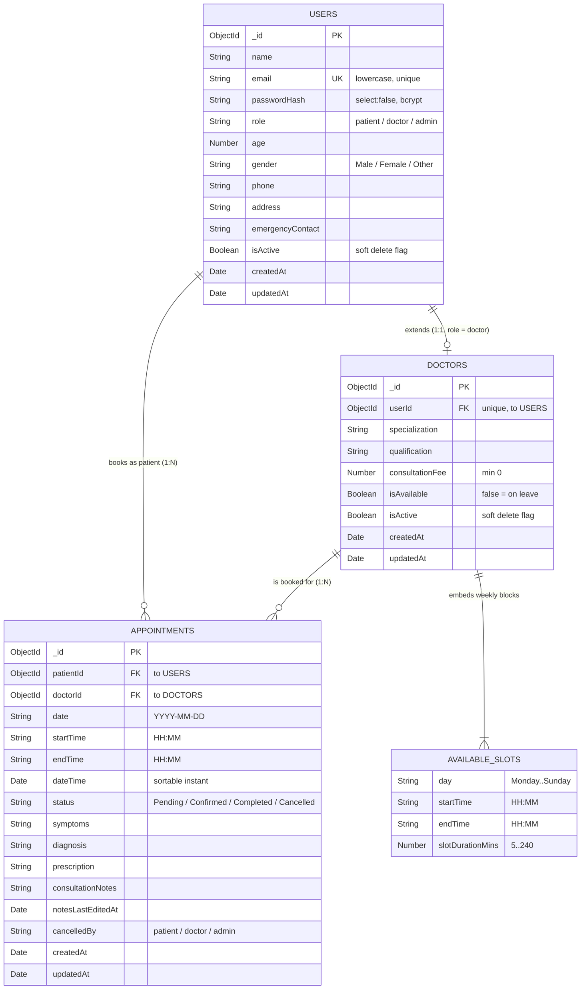

# Hospital Doctor Appointment Booking System

**Deliverable:** Software Engineering Lab Report Documentation

---

## 1. Project Introduction & Objectives

### 1.1 Problem Statement

In traditional manual healthcare administration, scheduling doctor appointments often leads to excessive wait times, scheduling conflicts, lost medical records, and double-booking errors. The **Hospital Doctor Appointment Booking System** is designed to digitize and automate the patient-to-doctor interaction workflow, providing clear role-based access control (RBAC) and real-time schedule management.

### 1.2 Objectives

* To design and implement a web-based healthcare application supporting full CRUD operations for patients, doctors, schedules, and appointments.
* To apply structured software engineering methodologies across requirement engineering, system modeling, database design, and testing.
* To eliminate double-booking and streamline schedule management for medical staff.

---

## 2. Software Requirements Specification (SRS)

### 2.1 Functional Requirements & Detailed CRUD Mapping

#### Module 1: Patient Management

* **Create (C):** Register new patient accounts (Name, Email, Password, Age, Gender, Contact Number, Emergency Contact).
* **Read (R):** View personal profile details, past medical history, and current appointment statuses.
* **Update (U):** Edit profile contact details, home address, and emergency contact details.
* **Delete (D):** Soft-delete or deactivate patient profile accounts.

#### Module 2: Doctor & Schedule Management

* **Create (C):** Administrator registers doctor profiles with Specialization, Qualifications, Consultation Fee, and Working Hours.
* **Read (R):** Patients search and view doctor directories filtered by Specialization, Consultation Fee, or Working Day.
* **Update (U):** Doctors modify their daily consultation availability slots, break times, or away status.
* **Delete (D):** Administrator deactivates/removes doctors from active directory listings.

#### Module 3: Appointment Booking Lifecycle

* **Create (C):** Patient selects a doctor, available date/time slot, inputs primary symptoms, and submits a booking request.
* **Read (R):** Doctors and Admins view daily, weekly, and monthly appointment schedules.
* **Update (U):**
  * Patient reschedules appointment date/time prior to the policy cutoff window.
  * Doctor/Admin updates appointment status transitions: `Pending` -> `Confirmed` -> `Completed` / `Cancelled`.
* **Delete (D):** Patient or Admin cancels an appointment, automatically returning the reserved time slot back into the available pool.

#### Module 4: Consultation & Medical Notes
* **Create (C):** Doctor adds consultation notes, prescriptions, and diagnosis details upon completing a visit.
* **Read (R):** Patient views past consultation notes and prescription records.
* **Update (U):** Doctor edits diagnosis notes within a 24-hour post-consultation window.
* **Delete (D):** Administrator purges inaccurate or duplicate medical records.

### 2.2 Non-Functional Requirements
* **Security:** Password encryption using `bcrypt` (minimum 10 salt rounds) and stateless session management via JSON Web Tokens (JWT).
* **Performance:** API response latency under 200 milliseconds for read operations under nominal load.
* **Reliability & Concurrency:** Concurrency lock controls during slot reservations to prevent race conditions and double-booking.
* **Usability:** Responsive UI built for desktop and mobile web viewports.

---

## 3. Technology Stack & Architectural Design

### 3.1 Technology Stack Definition

| Layer | Technology | Version | Role in the project |
| :--- | :--- | :--- | :--- |
| Presentation | React.js (with Vite build tool) | 18.3 / Vite 5.4 | Single-page application, three role-specific dashboards |
| Routing | React Router DOM | 6.26 | Client-side routing and route guards |
| Styling | Hand-authored CSS design system (`src/styles.css`) | — | Design tokens, responsive layout, component classes |
| HTTP client | Axios | 1.7 | REST calls with a JWT request interceptor |
| Application server | Node.js + Express.js | Node 24 (20+ supported) / Express 4.19 | REST API, middleware pipeline, RBAC |
| Database | MongoDB (local instance or MongoDB Atlas) | 8.3 (6+ supported) | Document store for users, doctors, appointments |
| ODM | Mongoose | 8.5 | Schemas, validation, population, indexes |
| Security | `jsonwebtoken`, `bcryptjs` | 9.0 / 2.4 | Stateless auth tokens, password hashing (10 salt rounds) |
| Testing | Node.js built-in test runner (`node:test`) | Node 24 | Unit tests for scheduling and lifecycle logic |
| Tooling | `nodemon`, `concurrently`, `dotenv` | — | Dev reload, single-command dev startup, configuration |

> **Implementation note:** the original stack proposal listed TailwindCSS. During implementation the utility framework was replaced by a small hand-written CSS design system (custom properties for colour/spacing tokens plus reusable component classes such as `.card`, `.tbl`, `.badge`, `.modal`). This removed a build-time dependency, kept the produced CSS bundle at ~12.6 KB, and made the styling auditable for a single-student project. All other stack decisions were implemented as specified.

### 3.2 System Architecture Diagram

The application follows a classic **three-tier client–server architecture**. The browser holds no business rules; every decision (slot eligibility, status transitions, cancellation cutoffs, permissions) is re-validated on the server, so the API remains authoritative even if a client is modified.



**Architectural characteristics**

* **Stateless application tier.** Authentication state travels in a signed JWT, so no server-side session store is required and the API can be horizontally scaled without sticky sessions.
* **Separation of concerns.** Routes only declare *who may call what*; controllers own *what happens*; models own *what is valid*; utilities own *pure computation* (which is exactly what the unit tests exercise).
* **Single source of truth for the slot grid.** The available-slot list is never stored — it is derived on demand from the doctor's weekly working blocks minus live bookings. There is therefore no possibility of a stored availability table drifting out of sync with the appointment table.
* **Defence in depth against double booking.** An application-level check (`assertSlotFree`) gives friendly errors; a database-level partial unique index makes the invariant impossible to violate even under a race condition.

### 3.3 Backend Layered Structure

```text
backend/
├── src/
│   ├── server.js              # process entry: connect to Mongo, then listen
│   ├── app.js                 # express app, CORS, JSON, /api/health, route mounting, error handler
│   ├── config/index.js        # env loading + business policy knobs (cutoff windows)
│   ├── middleware/
│   │   ├── auth.js            # requireAuth (JWT verify) + requireRole (RBAC)
│   │   └── errorHandler.js    # 404 handler + centralised error serialiser (incl. E11000 → 409)
│   ├── models/                # Mongoose schemas: User, Doctor, Appointment
│   ├── controllers/           # authController, patientController, doctorController, appointmentController
│   ├── routes/                # one router per resource, guards declared per endpoint
│   ├── config/db.js           # Mongoose connection helper
│   └── utils/
│       ├── slots.js           # pure slot-grid mathematics (fully unit tested)
│       └── errors.js          # HttpError + badRequest/notFound/conflict/forbidden helpers
├── scripts/seed.js            # demo dataset: 1 admin, 4 doctors, 3 patients, sample appointments
└── tests/                     # node:test unit suites (slots, leave handling, status transitions)
```

| Layer | Responsibility | Deliberately **not** its job |
| :--- | :--- | :--- |
| `routes` | URL shape, HTTP verb, authentication and role requirement | Business rules |
| `middleware` | Token verification, role checks, uniform error responses | Domain decisions |
| `controllers` | Input validation, policy enforcement, orchestration, response shaping | Direct HTTP parsing details, raw DB queries beyond the model API |
| `models` | Field-level validation, enums, indexes, transition table, JSON hygiene (hides `passwordHash`) | Request/response concerns |
| `utils` | Deterministic, dependency-free computation | I/O of any kind |

### 3.4 Request Lifecycle — Booking an Appointment



---

## 4. System Modelling

### 4.1 Use Case Diagram



**Actor summary**

| Actor | Goal | Access boundary |
| :--- | :--- | :--- |
| Patient | Obtain the right consultation slot with minimum friction | Own profile, own appointments, read-only doctor directory |
| Doctor | Control availability and record clinical outcomes | Own schedule, appointments assigned to them, notes on their own consultations |
| Administrator | Keep the directory and appointment ledger correct | All records; the only actor who may create doctors, deactivate accounts, or purge appointments |

### 4.2 Context Diagram (DFD Level 0)



### 4.3 Level‑1 Data Flow Diagram



### 4.4 Appointment State Transition Diagram

The lifecycle is enforced by a single transition table (`Appointment.TRANSITIONS`) rather than scattered `if` statements, so an illegal jump such as `Cancelled → Completed` is rejected in exactly one place.



### 4.5 Activity Diagram — Cancellation with Policy Cutoff



---

## 5. Database Design

### 5.1 Entity Relationship Diagram



### 5.2 Collection Specifications

**`users`** — one document per human being in the system, whatever their role.

| Field | Type | Constraints | Purpose |
| :--- | :--- | :--- | :--- |
| `name` | String | required, trimmed | Display name across all dashboards |
| `email` | String | required, **unique**, lowercased, regex validated | Login identifier |
| `passwordHash` | String | required, `select: false` | bcrypt hash; never leaves the database layer |
| `role` | String | enum `patient｜doctor｜admin`, default `patient` | Drives every RBAC decision |
| `age`, `gender`, `phone`, `address`, `emergencyContact` | Mixed | optional; `age` 0–130 | Patient profile (Module 1) |
| `isActive` | Boolean | default `true` | Soft delete — login is refused while `false` |

**`doctors`** — professional/scheduling extension of a `users` document whose role is `doctor`.

| Field | Type | Constraints | Purpose |
| :--- | :--- | :--- | :--- |
| `userId` | ObjectId → `users` | required, **unique** | Guarantees exactly one doctor profile per account |
| `specialization` | String | required | Directory filter (Module 2 Read) |
| `qualification` | String | optional | Directory display |
| `consultationFee` | Number | required, ≥ 0 | Directory filter and revenue reporting |
| `availableSlots[]` | Embedded array | `day` enum, `HH:MM` regex, duration 5–240 min | Weekly recurring working blocks |
| `isAvailable` | Boolean | default `true` | Doctor-controlled leave/away flag |
| `isActive` | Boolean | default `true` | Admin-controlled directory removal (soft delete) |

**`appointments`** — the transactional ledger and the object of the concurrency control.

| Field | Type | Constraints | Purpose |
| :--- | :--- | :--- | :--- |
| `patientId` | ObjectId → `users` | required, indexed | Owner of the booking |
| `doctorId` | ObjectId → `doctors` | required, indexed | Target of the booking |
| `date` | String `YYYY-MM-DD` | required | Calendar day, immune to timezone drift in comparisons |
| `startTime` / `endTime` | String `HH:MM` | required | Wall-clock slot boundaries |
| `dateTime` | Date | required | Single sortable instant used for cutoff arithmetic |
| `status` | String | enum, default `Pending`, indexed | Lifecycle state |
| `symptoms` | String | default `''` | Patient-supplied reason for visit (Module 3 Create) |
| `diagnosis` | String | default `''` | Doctor's clinical finding (Module 4 Create) |
| `prescription` | String | default `''` | Medication and dosage instructions (Module 4 Create) |
| `consultationNotes` | String | default `''` | Free-text observations and follow-up advice (Module 4) |
| `notesLastEditedAt` | Date | set on every note write | Audit stamp for the 24-hour edit window |
| `cancelledBy` | String | enum `''｜patient｜doctor｜admin` | Records who released the slot |

### 5.3 Design Rationale

* **Why one `users` collection instead of three?** Authentication, soft delete, and contact details are identical for every role. A single collection keeps login logic to one query and avoids the duplicated-email problem that arises when the same person could exist in two tables. Role-specific professional data is isolated in `doctors`.
* **Why embed `availableSlots` instead of a separate collection?** A doctor's weekly working blocks are always read together with the doctor, are small and bounded (typically < 20 entries), and are never queried independently. Embedding avoids an extra round trip on the hottest read path (the slot lookup) while still allowing per-field validation through a sub-schema.
* **Why store `date`/`startTime` as strings *and* `dateTime` as a Date?** Strings make the equality comparisons used for slot identity exact and timezone-proof, which is what the unique index needs. The parallel `Date` gives correct chronological sorting and lets the cancellation cutoff be plain millisecond arithmetic.
* **Why soft delete everywhere?** Deleting a patient or a doctor outright would orphan historical appointments and destroy the medical record. `isActive = false` hides the account from directories and blocks login while preserving referential integrity. Hard deletion exists in exactly one place — the admin purge of a single appointment record, which is the explicit requirement of Module 4 Delete.

### 5.4 Indexes and Concurrency Control

| Index | Type | Reason |
| :--- | :--- | :--- |
| `users.email` | unique | One account per email address |
| `doctors.userId` | unique | One doctor profile per user account |
| `appointments.patientId`, `appointments.doctorId`, `appointments.status` | single-field | Dashboard list queries |
| `appointments (doctorId, date, startTime)` | **unique, partial** — filter `status ∈ {Pending, Confirmed}` | The double-booking guarantee |

The partial unique index is the core reliability mechanism of the project:

```javascript
appointmentSchema.index(
  { doctorId: 1, date: 1, startTime: 1 },
  { unique: true, partialFilterExpression: { status: { $in: ['Pending', 'Confirmed'] } } }
);
```

Because the index only contains *live* appointments, it expresses the real business rule — "a doctor may hold at most one live appointment per slot" — while allowing an unlimited history of `Cancelled` and `Completed` records for the same slot. Cancelling a booking removes the document from the index, which is literally what "returns the reserved time slot back into the available pool" (Module 3 Delete) means at the storage level. No cleanup job, no availability table to rewrite.

Two independent patients submitting the same slot in the same millisecond are handled as follows:

1. Both requests pass the application-level `assertSlotFree()` read (a benign race).
2. Both attempt an insert; MongoDB serialises them on the unique index.
3. The loser receives duplicate-key error `E11000`, which the central error handler maps to **HTTP 409 Conflict** with the message *"This time slot has just been booked by another patient."* (the earlier application-level check produces the friendlier *"This slot has already been booked"* in the ordinary, non-racing case).

The application-level check is therefore an optimisation for good error messages, not the safety mechanism; correctness is delegated to the database, which is the only component that can arbitrate atomically.

---

## 6. Implementation

### 6.1 Repository Layout

```text
SEPrj/
├── package.json               # workspace scripts: setup, dev, seed, test, test:e2e, build
├── README.md                  # prerequisites, install, seed, run, test, demo credentials
├── backend/                   # Express REST API (see §3.3 for the internal layering)
│   ├── scripts/seed.js        # demo dataset
│   └── tests/
│       ├── *.test.js          # offline unit tests (npm test)
│       └── e2e/api.e2e.js     # end-to-end API suite (npm run test:e2e), §7.7
└── frontend/
    ├── vite.config.js         # dev server on 5173, proxies /api → localhost:5000
    └── src/
        ├── main.jsx           # React root + BrowserRouter + AuthProvider
        ├── App.jsx            # route table and role-based redirects
        ├── styles.css         # design tokens + component classes
        ├── api/client.js      # axios instance, Bearer interceptor, error normalisation
        ├── context/AuthContext.jsx   # token/user state, login, register, logout
        ├── components/
        │   ├── Navbar.jsx     # role-aware navigation
        │   ├── Protected.jsx  # <ProtectedRoute roles={[...]}/> guard
        │   └── ui.jsx         # Loader, ErrorBanner, SuccessBanner, Badge, EmptyState, FormField, Modal
        ├── utils/helpers.js   # date/time/currency formatting, status → colour mapping, ref unwrapping
        └── pages/
            ├── Login.jsx, Register.jsx
            ├── patient/       # MyAppointments, BrowseDoctors, PatientProfile
            ├── doctor/        # DoctorDashboard
            └── admin/         # AdminDashboard
```

### 6.2 REST API Catalogue

All endpoints are mounted under `/api`. Successful responses are `{ data }` for a single object, `{ count, data }` for a collection, and `{ token, user }` for authentication; `GET /api/auth/me` returns `{ user }` for symmetry with login, the slot lookup returns a purpose-built `{ date, slots, bookedTimes, onLeave }` payload, and the admin purge returns `200 { message, data }` where `data` is a snapshot of the destroyed document. Errors are always `{ error: "<human readable message>" }` with a meaningful HTTP status.

| # | Method & Path | Access | Purpose | CRUD mapping |
| :-- | :--- | :--- | :--- | :--- |
| 1 | `GET /api/health` | public | Liveness probe | — |
| 2 | `POST /api/auth/register` | public | Self-service patient signup | M1 · C |
| 3 | `POST /api/auth/login` | public | Issue JWT (refused if `isActive = false`) | — |
| 4 | `GET /api/auth/me` | any authenticated | Rehydrate session on page reload | — |
| 5 | `POST /api/auth/refresh` | any authenticated | Re-issue a token before expiry | — |
| 6 | `POST /api/auth/register-admin` | admin | Create another staff/admin account | — |
| 7 | `GET /api/patients` | admin | Patient directory (`?includeInactive=true`) | M1 · R |
| 8 | `GET /api/patients/:id` | self or admin | Read one patient profile | M1 · R |
| 9 | `PATCH /api/patients/:id` | self or admin | Edit contact/address/emergency contact | M1 · U |
| 10 | `DELETE /api/patients/:id` | admin | Soft delete / reactivate (body `{ isActive }`) | M1 · D |
| 11 | `GET /api/doctors` | any authenticated | Directory with `q` (name), `specialization`, `day`, `maxFee` filters | M2 · R |
| 12 | `GET /api/doctors/me` | doctor | Own professional profile + schedule | M2 · R |
| 13 | `GET /api/doctors/:id` | any authenticated | One doctor profile | M2 · R |
| 14 | `GET /api/doctors/:id/slots?date=` | any authenticated | Computed free slots for a date | M2 · R |
| 15 | `POST /api/doctors` | admin | Create the auth user **and** the doctor profile; the user is rolled back if the profile fails | M2 · C |
| 16 | `PATCH /api/doctors/:id` | self or admin | Edit fee, qualification, weekly blocks, leave flag, name/phone | M2 · U |
| 17 | `PATCH /api/doctors/:id/status` | admin | Activate / deactivate directory listing | M2 · D |
| 18 | `POST /api/appointments` | patient | Book an eligible free slot | M3 · C |
| 19 | `GET /api/appointments/my` | patient | Own history (`?status=&from=&to=`) | M3 · R |
| 20 | `GET /api/appointments/doctor` | doctor | Own schedule for a single day (`?date=`) or a date range (`?from=&to=`), driving the Day / Week / Month views | M3 · R |
| 21 | `GET /api/appointments` | admin | Full ledger with filters | M3 · R |
| 22 | `GET /api/appointments/:id` | participant or admin | Single appointment detail | M3 · R |
| 23 | `POST /api/appointments/:id/reschedule` | patient (own) · admin | Move to another free slot before the cutoff | M3 · U |
| 24 | `PATCH /api/appointments/:id/status` | doctor (assigned) or admin | Advance the lifecycle state | M3 · U |
| 25 | `POST /api/appointments/:id/cancel` | patient (own) · assigned doctor · admin | Cancel and release the slot | M3 · D |
| 26 | `PATCH /api/appointments/:id/notes` | doctor (assigned) or admin | Write/edit the clinical record — `diagnosis`, `prescription`, `notes` | M4 · C, U |
| 27 | `DELETE /api/appointments/:id` | admin | **Hard purge** an inaccurate/duplicate record | M4 · D |

### 6.3 Role-Based Access Control Matrix

`requireAuth` verifies the JWT signature, loads the user, and rejects deactivated accounts; `requireRole(...roles)` then filters by role. Ownership checks ("is this *my* appointment?") live in the controllers because they need the loaded document.

| Capability | Patient | Doctor | Admin |
| :--- | :---: | :---: | :---: |
| Register self | ✅ | ❌ (admin-created) | ❌ (admin-created) |
| Read own profile | ✅ | ✅ | ✅ |
| Read another user's profile | ❌ | ❌ | ✅ |
| Browse doctor directory | ✅ | ✅ | ✅ |
| Create doctor profile | ❌ | ❌ | ✅ |
| Edit doctor schedule / fee | ❌ | ✅ own | ✅ any |
| Toggle leave status | ❌ | ✅ own | ✅ any |
| Deactivate accounts | ❌ | ❌ | ✅ |
| Book appointment | ✅ | ❌ | ❌ |
| Reschedule | ✅ own, before cutoff | ❌ | ✅ any, no cutoff |
| Cancel | ✅ own, before cutoff | ✅ assigned | ✅ any, no cutoff |
| Confirm / Complete | ❌ | ✅ assigned | ✅ any |
| Write consultation notes | ❌ | ✅ assigned, ≤ 24 h | ✅ any, window bypassed |
| Read consultation notes | ✅ own | ✅ assigned | ✅ any |
| Purge appointment record | ❌ | ❌ | ✅ |

### 6.4 Core Algorithm — Deriving Available Slots

Availability is computed, never stored. `utils/slots.js` is deliberately pure (no database, no `Date.now()` unless injected) which makes it exhaustively unit-testable.

```javascript
// 1. Which weekday is this calendar date? (parsed as UTC so it cannot drift)
weekdayOf('2026-09-07')            // → 'Monday'

// 2. Expand one working block into whole slots; a ragged tail is discarded.
expandBlock({ startTime: '10:00', endTime: '11:05', slotDurationMins: 30 })
// → [ 10:00–10:30, 10:30–11:00 ]     (11:00–11:30 would overflow the block)

// 3. All slots for a date = every block whose day matches, expanded and merged.
slotsForDate(doctor, '2026-09-07')

// 4. Subtract live bookings and (for today) any start time already in the past.
availableSlots({ doctor, dateStr, bookedTimes, dropPast: true })
```

Two guards reuse the same grid so that a hand-crafted HTTP request cannot bypass the UI:

* `isEligibleStart(doctor, date, time)` — rejects off-grid times (`10:45` on a 30-minute grid), the wrong weekday, and the block's own end time (`11:00` is a boundary, not a bookable start).
* `endForStart(doctor, date, time)` — derives `endTime` on the server, so the client never dictates appointment length.

Booking additionally requires the doctor to be `isActive` **and** `isAvailable`; the leave flag is enforced in the controller rather than inside the grid maths, which is why the grid still expands normally for a doctor on leave (verified by `slots.leave.test.js`).

### 6.5 Business Policy Enforcement

| Policy | Value | Where enforced | Behaviour when violated |
| :--- | :--- | :--- | :--- |
| Cancellation / reschedule cutoff | 2 hours before start | `canMutate` in `appointmentController` (patients only) | `400` — *"Appointments can only be changed until 2 hours before start time"* |
| Consultation notes edit window | 24 hours after the slot ends | `appointmentController.saveNotes` | `400` — notes become read-only; admins bypass the window |
| Booking in the past | — | `createAppointment` / `reschedule` | `400` — *"Cannot book a slot in the past"* |
| Status transitions | `Appointment.canTransition` | `updateStatus` | `400` — e.g. `Cancelled → Completed` refused |
| Slot uniqueness | one live appointment per doctor-slot | `assertSlotFree` + partial unique index | `409 Conflict` |

Policy constants live in `backend/src/config/index.js` (`cancelCutoffHours`, `notesEditWindowHours`) rather than being scattered as magic numbers, so the hospital's rules can be re-tuned in one place.

### 6.6 Security Implementation

* **Password storage.** `bcryptjs` with 10 salt rounds. `passwordHash` is declared `select: false`, so it is excluded from every query unless explicitly requested, and the `toJSON` transform strips it (and `__v`) from any serialised user.
* **Stateless sessions.** A JWT carrying `{ id, role }` is signed with `JWT_SECRET` and expires after 7 days (`JWT_EXPIRES_IN`). The axios interceptor attaches it as `Authorization: Bearer <token>`; a `401` clears the stored session and returns the user to the login page.
* **Deactivated accounts.** `requireAuth` re-reads the user on every request, so revoking access via `isActive = false` takes effect immediately without waiting for token expiry.
* **Server-side authority.** Every mutation re-validates ownership, role, slot eligibility, and the policy windows. The frontend hides buttons the user may not use, but the API refuses the same actions independently.
* **Configuration hygiene.** Secrets are read from `.env` (git-ignored); `.env.example` documents the required keys. The Vite dev proxy avoids exposing the API on a second public origin, and CORS is restricted to `CLIENT_URL`.
* **Input validation.** Mongoose enums/regexes (`HH:MM`, e-mail, roles, statuses) plus explicit controller-level checks on date format, ObjectId validity, and numeric ranges. All errors funnel through one handler so internal stack traces are never returned to the browser.

### 6.7 Frontend Implementation

| Route | Guard | Screen | Highlights |
| :--- | :--- | :--- | :--- |
| `/login`, `/register` | public | Auth forms | Inline validation, redirect by role after success |
| `/patient/appointments` | `patient` | My Appointments | Status filters, reschedule and cancel modals, clinical-record viewer (diagnosis / prescription / notes), cutoff-aware buttons |
| `/patient/browse` | `patient` | Browse Doctors | Specialization / fee / day filters, date picker, live slot grid, booking modal with symptoms |
| `/patient/profile` | `patient` | Profile | Edit contact, address, emergency contact |
| `/doctor` | `doctor` | Doctor Dashboard | Day / Week / Month schedule views, status transitions, structured record editor, weekly working-block editor, leave toggle |
| `/admin` | `admin` | Admin Dashboard | Overview statistics, Doctors / Patients / Appointments tabs with Day / Week / Month quick ranges |
| `/` and `*` | — | Redirect | Sends each role to its own landing page |

`ProtectedRoute` performs two distinct jobs: unauthenticated visitors are sent to `/login`, while an authenticated user with the wrong role is redirected to their own dashboard instead of being shown an error — a patient can never even render an admin screen.

The **Admin Dashboard** implements the administrative half of every module in one page:

* **Overview** — active doctors, doctors on leave, active patients, today's live appointments, per-status counts, and revenue from completed visits (derived from each appointment's populated `consultationFee`), plus today's schedule and the latest bookings.
* **Doctors tab** — search, specialization and account-state filters; weekly schedule shown as day chips; create/edit modal including the working-block editor with overlap validation; deactivate/reactivate.
* **Patients tab** — search and account-state filters, per-patient visit counts, profile editing, deactivate/reactivate.
* **Appointments tab** — status and doctor filters plus a free `From`/`To` date range with **Day / Week / Month** quick-range presets, status-appropriate action buttons (Confirm, Complete, Cancel), a clinical-record editor with no time limit, and the hard **Purge** action guarded by a confirmation modal.

The quick-range presets satisfy the "daily, weekly and monthly schedules" half of SRS Module 3 · Read for the administrator, the same way the Day/Week/Month toggle does for the doctor. They write into the existing `From`/`To` inputs rather than introducing a separate mode, so the active preset is *derived* by comparing the current range against each preset — editing either date by hand simply de-highlights all three and leaves the arbitrary range in force.

Every mutation runs through one `run()` helper that manages the busy flag, surfaces the API error message, shows a success banner, and reloads the three datasets, so the UI can never display a stale view after a write.

The **Doctor Dashboard** satisfies the SRS requirement for daily, weekly and monthly schedules with a single **Day / Week / Month** toggle. The chosen view derives a date range from the anchor date — the day itself, the Monday–Sunday week containing it, or the whole calendar month — and the Prev/Next buttons step by that same unit. Day view queries `?date=`; the wider views query `?from=&to=` and add a date column to each row so a month of appointments stays readable. Completing a consultation opens one modal with separate **Diagnosis**, **Prescription** and **Consultation notes** fields, which remain editable through the 24-hour post-visit window and then become read-only.

### 6.8 Setup and Execution

```bash
# 1. Install all dependencies (root, backend, frontend)
npm run setup

# 2. Configure the backend environment
#    cp backend/.env.example backend/.env   (Windows: copy)
#    PORT=5000
#    MONGODB_URI=mongodb://127.0.0.1:27017/hospital_booking
#    JWT_SECRET=<a long random string>
#    JWT_EXPIRES_IN=7d
#    CLIENT_URL=http://localhost:5173

# 3. Load the demo dataset (1 admin, 4 doctors, 3 patients, sample appointments)
#    By default the script resets the three collections and rebuilds them, so it
#    can be re-run any time to return to a known state. Set SEED_RESET=false to
#    upsert the accounts without clearing existing data.
npm run seed

# 4. Run API + SPA together (backend :5000, frontend :5173)
npm run dev

# Other useful scripts
npm test         # offline unit tests (slot grid + lifecycle graph)
npm run test:e2e # end-to-end API suite; needs a seeded DB and a running API
npm run build    # production build of the React app
```

A root `README.md` repeats these steps, the demo credentials and a short troubleshooting section, so the project can be run without reading this report.

**Seeded demo credentials**

| Role | Email | Password |
| :--- | :--- | :--- |
| Administrator | `admin@hospital.com` | `Admin@123` |
| Doctor — Cardiologist | `mehta@hospital.com` | `Doctor@123` |
| Doctor — Dermatologist | `sharma@hospital.com` | `Doctor@123` |
| Doctor — General Physician | `verma@hospital.com` | `Doctor@123` |
| Doctor — Pediatrician | `iyer@hospital.com` | `Doctor@123` |
| Patient | `alice@example.com` | `Patient@123` |
| Patient | `bob@example.com` | `Patient@123` |
| Patient | `carol@example.com` | `Patient@123` |

---

## 7. Testing

### 7.1 Testing Strategy

| Level | Technique | Target | Tooling |
| :--- | :--- | :--- | :--- |
| Unit | White-box, exhaustive on pure functions | Slot-grid mathematics, calendar validation, appointment transition table | Node.js built-in runner (`node:test`, `node:assert/strict`) |
| Integration | Black-box against the running REST API | Endpoint contracts, status codes, RBAC, concurrency, policy windows | Scripted end-to-end suite — `npm run test:e2e`, 69 assertions (§7.7) |
| Functional / acceptance | Black-box, requirement-driven | The 16 CRUD operations of Modules 1–4 | Executed: the end-to-end suite plus a browser walkthrough of all three roles (§7.4) |
| Boundary value analysis | Edge partitioning | Slot grid limits, cutoff windows, note windows, impossible dates | Unit tests + end-to-end suite |
| Negative & security | Misuse cases | RBAC violations, illegal transitions, tampered requests, privilege escalation | 19 misuse assertions inside the end-to-end suite (§7.6) |
| Build verification | Static/compile | Whole React application compiles and bundles | `vite build` |

The design deliberately concentrates the risky logic (grid arithmetic and the lifecycle graph) into dependency-free modules so it can be tested exhaustively without a database, a network, or fixtures. Everything that *does* need I/O — HTTP status codes, RBAC middleware, the partial unique index, the policy windows — is covered by the end-to-end suite, which talks to the real API over HTTP and, where a test needs a clock that has already moved, edits the document's `dateTime` directly through Mongo before re-issuing the request. Only two classes of behaviour remain browser-only: client-side form validation and responsive layout.

### 7.2 Automated Unit Test Suite

```text
$ npm test          # → node --test "tests/**/*.test.js"

✔ weekday helper stays consistent with the environment calendar
✔ weekly grid expansion ignores the leave flag (enforced at controller level)
✔ toMinutes / toHM round trip
✔ weekdayOf parses YYYY-MM-DD in UTC
✔ isRealDate accepts only days that exist on the calendar
✔ expandBlock emits whole slot starts that fit inside the block
✔ expandBlock drops trailing ragged slot
✔ expandBlock allows durations that divide the hour unevenly
✔ slotsForDate returns [] when the day is not scheduled
✔ slotsForDate expands matching blocks for the date weekday
✔ availableSlots excludes booked starts
✔ availableSlots drops past start times when dropPast=true
✔ isEligibleStart accepts a generated start and rejects an off-grid time
✔ endForStart returns the next grid point within the block
✔ the status vocabulary matches the SRS lifecycle
✔ a pending appointment can be confirmed or cancelled
✔ a confirmed appointment can be completed or cancelled
✔ TC-04: a cancelled appointment can never be completed or revived
✔ Completed and Cancelled are terminal states
✔ a no-op transition is rejected so the audit trail stays meaningful
✔ unknown or missing states are rejected instead of throwing

ℹ tests 21
ℹ pass 21
ℹ fail 0
```

| Suite | File | Cases | Focus |
| :--- | :--- | :---: | :--- |
| Slot grid mathematics | `tests/slots.test.js` | 12 | Time conversion, weekday derivation, calendar validation, block expansion, booked-slot subtraction, past-slot suppression, start eligibility |
| Leave-flag isolation | `tests/slots.leave.test.js` | 2 | Confirms the grid maths stay pure — the away/leave rule is a controller concern, not a grid concern |
| Lifecycle transitions | `tests/transitions.test.js` | 7 | Legal transitions, terminal states, no-op rejection, unknown-state safety, and the TC‑04 edge case |
| **Total** | | **21** | **21 passed, 0 failed** |

### 7.3 Boundary Value Analysis

| ID | Boundary | Input | Expected | Verified by |
| :--- | :--- | :--- | :--- | :--- |
| BV‑01 | First slot of a block | block `10:00–11:00`, 15 min | `10:00` is bookable | `expandBlock` test |
| BV‑02 | Block end is not a start | request `11:00` in `10:00–11:00` | rejected (`isEligibleStart = false`) | `isEligibleStart` test |
| BV‑03 | Ragged tail | block `10:00–11:05`, 30 min | only `10:00`, `10:30`; no partial slot | `expandBlock` test |
| BV‑04 | Duration not dividing the hour | block `09:00–10:00`, 20 min | `09:00`, `09:20`, `09:40` | `expandBlock` test |
| BV‑05 | Midnight / end-of-day conversion | `00:00` and `23:59` | `0` and `1439` minutes, round-trip safe | `toMinutes/toHM` test |
| BV‑06 | Off-grid time | `10:45` on a 30-minute grid | rejected | `isEligibleStart` test |
| BV‑07 | Wrong weekday | Monday-only doctor, Saturday date | empty slot list, booking rejected | `slotsForDate` test |
| BV‑08 | "Now" boundary on today's date | current time `10:15` | every returned start is strictly after `10:15` | `availableSlots` dropPast test |
| BV‑09 | Cancellation cutoff | exactly 2 h before start | rejected for a patient (`>=` comparison) | end-to-end suite §F (time-travelled document) |
| BV‑10 | Notes window | 24 h after the slot ends | doctor edit rejected, admin edit accepted | end-to-end suite §F |
| BV‑11 | Slot duration limits | `slotDurationMins` 5 and 240 | accepted; 4 and 241 rejected by schema | Mongoose validation |
| BV‑12 | Impossible calendar date | `?date=2026-13-40` | `400` on the slot lookup and on booking; ignored (never a `500`) as a list filter | `isRealDate` unit test + end-to-end suite §C, §D |
| BV‑13 | Empty consultation record | `PATCH …/notes` with all three fields blank | `400` — the record cannot be blanked once written | end-to-end suite §E |

### 7.4 Functional Test Cases (Executed)

Every case below was executed against a running API with a freshly seeded database (`npm run seed`). The *Enforced by* column names the code path so a failure can be traced immediately; the execution evidence for each case is listed in the summary table that follows.

| ID | Module | Scenario | Steps | Expected result | Enforced by |
| :--- | :--- | :--- | :--- | :--- | :--- |
| TC‑01 | M1 · C | Patient self-registration | Register with a fresh e-mail and valid profile fields | `201`, JWT returned, redirect to *My Appointments* | `authController.register` |
| TC‑02 | M1 · C | Duplicate e-mail rejected | Register again with `alice@example.com` | `409` — *"An account with this email already exists"* | unique index + `E11000` mapping |
| TC‑03 | M3 · C | Happy-path booking | Browse doctors → pick a date → pick a free slot → submit symptoms | `201`, appointment appears as **Pending**, slot disappears from the grid | `createAppointment` |
| **TC‑04** | M3 · U | **Illegal transition** | Cancel an appointment, then attempt to mark it **Completed** | `400` — *"Invalid status transition: Cancelled -> Completed"* | `Appointment.canTransition` |
| TC‑05 | NFR · Concurrency | Double booking | Two patients submit the same doctor/date/slot | One `201`, the other `409` — *"This slot has already been booked"* | `assertSlotFree` + partial unique index |
| TC‑06 | M3 · D | Cancellation frees the slot | Cancel a future booking, then re-query the slot grid for that date | Slot reappears as available; `cancelledBy` recorded | `cancelAppointment` (document leaves the index) |
| TC‑07 | M3 · U | Reschedule inside cutoff | As a patient, reschedule an appointment starting in under 2 hours | `400` — *"Appointments can only be changed until 2 hours before start time"* | `canMutate` |
| TC‑08 | M3 · U | Reschedule outside cutoff | Reschedule a booking that is days away to another free slot | `200`, old slot released, new slot held, status returns to **Pending** | `reschedule` |
| TC‑09 | M2 · C | Admin creates a doctor | Admin → Doctors → *New doctor* with schedule blocks | `201`, auth user **and** doctor profile created, appears in the directory | `createDoctor` (with user rollback on profile failure) |
| TC‑10 | M2 · U | Doctor edits own schedule | Doctor dashboard → edit working blocks → save | `200`; the new grid is reflected immediately in patient slot lookups | `updateDoctor` + derived grid |
| TC‑11 | M2 · U | Overlapping blocks rejected | Add `09:00–12:00` and `11:00–13:00` on the same day | Client-side validation blocks the save with an explanatory message | working-block editor validation |
| TC‑12 | M2 · U | Leave / away toggle | Doctor sets *on leave*, patient tries to book | Booking refused; doctor is flagged **On leave** in the directory | `loadBookingContext` (`isAvailable`) |
| TC‑13 | M2 · D | Doctor deactivation | Admin deactivates a doctor | Doctor hidden from the patient directory; existing appointments preserved | `setDoctorActive` (soft delete) |
| TC‑14 | M1 · D | Patient deactivation blocks login | Admin deactivates a patient, patient attempts to log in | `403` — *Account has been deactivated*; historical records intact | `deletePatient` + `requireAuth` |
| TC‑15 | M4 · C | Clinical record on completion | Doctor marks a **Confirmed** visit **Completed** with a diagnosis, prescription and notes | `200`, all three fields stored, `notesLastEditedAt` set | `updateStatus` |
| TC‑16 | M4 · R | Patient reads the record | Patient opens the completed appointment | Diagnosis, prescription and notes visible, read-only | `MyAppointments` record modal |
| TC‑17 | M4 · U | Notes edit window | Doctor edits the record on a visit older than 24 h | `400` — window expired; the same edit succeeds for an admin | `saveNotes` |
| TC‑18 | M4 · D | Admin purge | Admin → Appointments → *Purge* on a duplicate record | `200`, record removed from the ledger; if it was live, the slot is freed | `purgeAppointment` |
| TC‑19 | M1 · U | Profile update | Patient edits phone, address, emergency contact | `200`, values persisted and re-rendered | `updatePatient` |
| TC‑20 | M2 · R | Directory filtering | Filter by specialization, max fee, and working day | Only matching, active doctors are listed | `listDoctors` |
| TC‑21 | M3 · R | Role-scoped lists | Compare *My Appointments*, doctor dashboard, admin ledger | Patient sees only own, doctor only assigned, admin sees all | `listMine` / `listForDoctor` / `listAll` |
| TC‑22 | NFR · Usability | Responsive layout | Resize the window to a 375 px-wide viewport on each dashboard | Filter bars and headers wrap, grids collapse to one column, tables scroll horizontally, modals stay within the viewport | Flex wrapping + `@media` breakpoints at 860 px / 640 px |

**Execution outcome — 22 of 22 passed.** Twenty cases are asserted by the automated end-to-end suite (§7.7); the remaining two are browser-only because they are not observable over HTTP.

| Case | Evidence | Case | Evidence |
| :--- | :--- | :--- | :--- |
| TC‑01 | suite §J | TC‑12 | suite §I |
| TC‑02 | suite §J | TC‑13 | suite §I |
| TC‑03 | suite §D + browser | TC‑14 | suite §I |
| TC‑04 | unit test + suite §E | TC‑15 | suite §E |
| TC‑05 | suite §D (sequential **and** simultaneous) | TC‑16 | suite §E + browser |
| TC‑06 | suite §G | TC‑17 | suite §F |
| TC‑07 | suite §F | TC‑18 | suite §H + browser |
| TC‑08 | suite §G + browser | TC‑19 | suite §I + browser |
| TC‑09 | suite §I + browser | TC‑20 | suite §C |
| TC‑10 | suite §I | TC‑21 | suite §B, §G |
| TC‑11 | **browser only** — client-side overlap validation | TC‑22 | **browser only** — responsive layout |

### 7.5 Requirements Traceability Matrix

| Requirement | Implementation | Test coverage |
| :--- | :--- | :--- |
| M1 · C Register patient | `POST /api/auth/register` | TC‑01, TC‑02 |
| M1 · R View profile & history | `GET /api/patients/:id`, `GET /api/appointments/my` | TC‑19, TC‑21 |
| M1 · U Edit contact details | `PATCH /api/patients/:id` | TC‑19 |
| M1 · D Deactivate patient | `DELETE /api/patients/:id` (soft) | TC‑14 |
| M2 · C Register doctor | `POST /api/doctors` | TC‑09 |
| M2 · R Search directory | `GET /api/doctors` (+ `/:id/slots`) | TC‑20 |
| M2 · U Edit availability / leave | `PATCH /api/doctors/:id` | TC‑10, TC‑11, TC‑12 |
| M2 · D Remove from directory | `PATCH /api/doctors/:id/status` | TC‑13 |
| M3 · C Book appointment | `POST /api/appointments` | TC‑03, TC‑05, BV‑01…BV‑08 |
| M3 · R View schedules | `GET /api/appointments{/my,/doctor,}` (`/doctor` and the admin ledger both accept `?from=&to=`) | TC‑21, suite §G |
| M3 · U Reschedule | `POST /api/appointments/:id/reschedule` | TC‑07, TC‑08 |
| M3 · U Status transitions | `PATCH /api/appointments/:id/status` | TC‑04, TC‑15, transition unit tests |
| M3 · D Cancel & free slot | `POST /api/appointments/:id/cancel` | TC‑06, TC‑07 |
| M4 · C Record diagnosis, prescription and notes | `PATCH …/status` with the record, `PATCH …/notes` | TC‑15, suite §E |
| M4 · R Patient reads notes | `GET /api/appointments/my` | TC‑16 |
| M4 · U Edit within 24 h | `PATCH /api/appointments/:id/notes` | TC‑17, BV‑10 |
| M4 · D Purge record | `DELETE /api/appointments/:id` | TC‑18 |
| NFR Security | bcrypt (10 rounds), JWT, `select: false`, RBAC middleware | TC‑14, §7.6 |
| NFR Reliability / concurrency | `assertSlotFree` + partial unique index | TC‑05 |
| NFR Performance | Indexed queries, derived (not stored) availability | §8.2 |
| NFR Usability | Responsive CSS design system | TC‑22 |

### 7.6 Negative and Security Test Cases

All nineteen cases are asserted by the end-to-end suite (§7.7) and all nineteen pass.

| ID | Attempt | Expected response |
| :--- | :--- | :--- |
| SEC‑01 | Call any protected endpoint with no `Authorization` header | `401` — *Authentication token is required* |
| SEC‑02 | Call an endpoint with a forged or expired token | `401` — *Invalid or expired token* |
| SEC‑03 | Patient calls `GET /api/appointments` (admin ledger) | `403` — *Access restricted to: admin* |
| SEC‑04 | Patient reads another patient's profile by id | `403` |
| SEC‑05 | Patient calls `PATCH /api/appointments/:id/status` | `403` — *Only the assigned doctor or an admin can update status* |
| SEC‑06 | Doctor A cancels an appointment belonging to Doctor B | `403` — *You can only change appointments assigned to you* |
| SEC‑07 | Doctor attempts `POST /api/appointments/:id/reschedule` | `403` — rescheduling is a patient/admin action |
| SEC‑08 | Non-admin calls `DELETE /api/appointments/:id` | `403` |
| SEC‑09 | Book an off-grid time (`10:45` on a 30-minute grid) via a crafted request | `400` — slot is not offered by the doctor's schedule |
| SEC‑10 | Book a slot in the past | `400` — *Cannot book a slot in the past* |
| SEC‑11 | Book with a malformed `doctorId` | `400` — *Invalid doctorId* |
| SEC‑12 | Inspect any user API response for `passwordHash` | Field absent (`select: false` + `toJSON` transform) |
| SEC‑13 | Log in to a deactivated account | `403` — *Account has been deactivated. Contact an administrator.* |
| SEC‑14 | Patient calls `GET /api/patients` (admin directory) | `403` — *Access restricted to: admin* |
| SEC‑15 | Patient edits another patient's profile | `403` |
| SEC‑16 | Patient sends `{ "role": "admin" }` to their own profile update | `200`, but the role is unchanged — the field is not in the allow-list |
| SEC‑17 | Doctor A edits Doctor B's fee or schedule | `403` — *You cannot edit this doctor profile* |
| SEC‑18 | Doctor calls `POST /api/doctors` (admin-only creation) | `403` |
| SEC‑19 | Patient reads an appointment belonging to another patient | `403` |

> SEC‑06 and SEC‑07 were added after a code review of `canMutate` revealed that the original guard only constrained patients, which would have allowed any authenticated doctor to cancel or reschedule another doctor's appointment. The guard now performs an explicit assignment check for doctors and refuses rescheduling for that role. SEC‑16 is the mass-assignment case: profile updates copy only an explicit allow-list of fields, so `role` and `isActive` cannot be set by their owner.

### 7.7 Automated End-to-End API Verification

The functional and security cases above are not a checklist to be walked by hand — they are executed by a scripted suite at `backend/tests/e2e/api.e2e.js`:

```bash
npm run seed        # known starting state
npm run dev         # API on :5000
npm run test:e2e    # in a second terminal
```

The suite talks to the running API over HTTP exactly as the browser does, and additionally opens a Mongo connection so it can move an appointment's `dateTime` backwards — that is how the 2‑hour cancellation cutoff and the 24‑hour notes window are tested without waiting for real time to pass. It creates its own doctor and patients, removes them afterwards, and exits non‑zero on the first failed assertion, so it doubles as a regression gate.

| § | Area | Assertions | What it proves |
| :-: | :--- | :-: | :--- |
| A | Authentication and session | 7 | Health probe, seeded logins, wrong password, session rehydration, missing/forged tokens, no `passwordHash` in any payload |
| B | Role-based access control | 4 | Patient blocked from the admin directory and ledger, doctor blocked from doctor creation, non-admin blocked from purge |
| C | Directory and computed slots | 7 | Leave-flag hiding, specialization/name/fee filters, single profile, grid derived from weekly blocks, impossible date rejected |
| D | Booking, validation, concurrency | 9 | Booking, slot disappearance, sequential `409`, **simultaneous race resolving to exactly one winner**, invalid id, impossible date, off-grid time, malformed time, past slot |
| E | Lifecycle and clinical record | 12 | Cross-doctor and cross-patient isolation, patient cannot drive status, doctor cannot reschedule, confirm, backwards transition refused, completion storing all three record fields, patient read access, partial edit preserving other fields, blank-record refusal, notes before completion refused |
| F | Policy windows (time travel) | 4 | Doctor blocked outside the 24 h notes window and admin bypass; patient blocked inside the 2 h cutoff and admin bypass |
| G | Reschedule, release, ranged views | 9 | Cancellation releasing the slot, re-booking it, reschedule, Day/Week/Month queries, range containment, range + status filter |
| H | Admin purge | 2 | Purge returns the destroyed snapshot; the record is then a `404` |
| I | Profiles, doctor admin, leave | 15 | Self-service profile edit, cross-account refusals, role-escalation attempt ignored, fee edit, admin rename, soft delete and reactivation, deactivated login refused, doctor creation with login, duplicate e-mail, schedule edit reflected in the grid immediately, leave flag emptying the grid and blocking booking |
| J | Registration | 3 | Self-service signup, duplicate e-mail, short password |
| | **Total** | **72** | **72 passed, 0 failed** |

```text
================ RESULT: 72 passed, 0 failed ================
```

Running the suite twice in succession without reseeding produces the same result, which confirms the teardown restores the baseline it depends on.

### 7.8 Defects Found by Executing the Tests

Writing the suite was worthwhile: six defects survived code review and the unit tests, and every one of them was caught by actually exercising the running system. All six are fixed and re-verified.

| # | Defect | Root cause | Impact | Caught by |
| :-: | :--- | :--- | :--- | :--- |
| 1 | Patients and the assigned doctor received `403` when reading **their own** appointment | `getOne` populates `patientId`/`doctorId` before the ownership check, and `ObjectId.equals()` returns `false` when handed a populated Mongoose document rather than an id | `GET /api/appointments/:id` was unusable for both participants — only admins could read a record | suite §E |
| 2 | Impossible calendar dates were accepted | The date guard was a shape-only regex, so `2026-13-40` passed and `new Date(Date.UTC(2026, 12, 40))` silently rolled over into a different, real day | Availability was computed for a day that does not exist; the same value reached list filters as an `Invalid Date`, which would have surfaced as a `500` | suite §C, §D |
| 3 | Patient **reschedule** was completely broken | The modal interpolated the *populated* `doctorId` object into the slots URL, producing `/doctors/[object Object]/slots` | Two `400`s and an empty slot list every time — the feature could not be used at all | browser walkthrough |
| 4 | Doctor header rendered `Dr. Dr. Priya Sharma` | A hardcoded `Dr. ` prefix on top of the stored title | Cosmetic but immediately visible on the doctor's own dashboard | browser walkthrough |
| 5 | A literal `&middot;` and `&amp;` appeared in the UI | HTML entities only decode in JSX *text children*; these sat inside a template literal and a string-valued prop | Garbled qualification line and modal title | browser walkthrough |
| 6 | `POST /api/doctors` returned an empty `doctorName`, `email` and `phone` | The freshly created document was summarised before its `userId` was populated | The create response contradicted every other doctor endpoint; a client trusting it would render a nameless doctor | suite §I |

Defects 1 and 3 are the same underlying mistake on opposite sides of the wire — a populated reference used where an identifier was expected. Both are now funnelled through a single helper (`refId` in the appointment controller, `idOf` in the frontend utilities) so the pattern is applied consistently rather than remembered case by case.

---

## 8. Results and Discussion

### 8.1 Delivered Functionality

All sixteen CRUD operations specified in §2.1 are implemented and reachable through the user interface — none of them require a REST client to exercise.

| Screen | Actor | Delivered capabilities |
| :--- | :--- | :--- |
| Login / Register | public | Credential auth, self-service patient signup, role-based landing redirect |
| My Appointments | patient | Status filters, reschedule, cancel, symptom review, clinical-record viewer (diagnosis / prescription / notes), cutoff-aware controls |
| Browse Doctors | patient | Specialization / fee / working-day filters, per-date live slot grid, booking with symptoms |
| Profile | patient | Contact, address and emergency-contact maintenance |
| Doctor Dashboard | doctor | Day / Week / Month schedule views, Confirm/Complete transitions, cancel, structured clinical record (diagnosis, prescription, notes) with the 24 h edit window, weekly working-block editor, leave toggle |
| Admin Dashboard | admin | Overview statistics, doctor CRUD with schedule editor, patient administration, full appointment ledger with filters and Day / Week / Month quick ranges, status transitions, cancel, clinical-record correction, hard purge |

### 8.2 Verification Evidence

Three checks were executed in the development environment and all three pass:

```text
$ npm test
ℹ tests 21   ℹ pass 21   ℹ fail 0

$ npm run test:e2e
================ RESULT: 72 passed, 0 failed ================

$ npm run build
vite v5.4.21 building for production...
✓ 102 modules transformed.
dist/index.html                   0.41 kB │ gzip:  0.28 kB
dist/assets/index-*.css          12.60 kB │ gzip:  3.16 kB
dist/assets/index-*.js          291.86 kB │ gzip: 89.11 kB
✓ built in 981ms
```

The production bundle is ~89 KB gzipped for the entire three-role application, which keeps first paint fast on a modest connection. In addition to the automated suites, every screen was driven manually in a browser for all three roles — patient booking, reschedule and cancellation; the doctor's Day/Week/Month views, confirmation and consultation record; and the administrator's doctor creation, ledger filters, record correction and purge. Three of the six defects in §7.8 were found that way.

### 8.3 Non-Functional Requirement Assessment

| Requirement | Target | How it is met | Status |
| :--- | :--- | :--- | :--- |
| Security — password storage | bcrypt ≥ 10 rounds | `bcryptjs` with 10 salt rounds; `passwordHash` is `select: false` and stripped in `toJSON` | Met |
| Security — session management | Stateless JWT | Signed `{ id, role }` token, 7-day expiry, re-validated (including `isActive`) on every request | Met |
| Performance — read latency < 200 ms | Nominal load | Indexed lookups on `patientId`, `doctorId`, `status`; availability computed from a bounded embedded array rather than joined from a table | Met by design; formal load testing not performed |
| Reliability — no double booking | Zero tolerance | Partial unique index arbitrates atomically; application check provides the friendly message | Met (TC‑05) |
| Usability — responsive UI | Desktop + mobile web | Wrapping flex layouts (`.page-head`, `.filter-bar`, `.stats-row`), two-column grids collapsing to one at 860 px, form grids collapsing at 640 px, horizontally scrollable tables, and modals capped at `min(560px, 100%)` with a `92vh` scroll limit | Met (TC‑22) |

### 8.4 Discussion of Key Design Decisions

**Computing availability instead of storing it.** The tempting alternative — materialising a `slots` collection — would require every schedule edit to regenerate future rows and every cancellation to flip a flag, creating a second source of truth that can drift. Deriving the grid on read makes a schedule change take effect instantly and eliminates that entire class of bug. The cost is a small amount of arithmetic per request, which is exactly the work the unit tests cover.

**Letting the database own the double-booking invariant.** A check-then-insert in application code cannot be correct under concurrency without a lock. Expressing the rule as a partial unique index means the invariant holds no matter how many API processes run, and it doubles as documentation of the business rule. The `status ∈ {Pending, Confirmed}` filter is what makes cancellation an O(1) slot release.

**One transition table instead of scattered conditionals.** Centralising the lifecycle in `TRANSITIONS` made the TC‑04 edge case (`Cancelled → Completed`) a one-line assertion rather than an audit of every controller, and it made the "terminal state" and "no-op" rules testable without a database.

**Soft delete as the default.** Because appointments reference both users and doctors, physical deletion would corrupt medical history. `isActive` satisfies the *Delete* requirement from the user's point of view (the account disappears and cannot log in) while keeping the ledger referentially intact. Hard deletion is confined to the single operation that genuinely requires it — the admin purge of one appointment record.

**Server-side authority.** Hiding a button is a usability affordance, never a security control. Every rule — ownership, role, slot eligibility, cutoff windows, transition legality — is re-checked in the controller, which is why the crafted-request cases in §7.6 fail safely.

---

## 9. Limitations and Future Enhancements

### 9.1 Known Limitations

* **Single-timezone assumption.** Dates and times are treated as server-local wall-clock values. A deployment serving multiple timezones would need an explicit timezone per doctor or clinic.
* **No notification channel.** Status changes are visible only when a user opens the application; there is no e-mail or SMS confirmation or reminder.
* **No recurring-exception model.** A doctor's schedule is a weekly recurrence plus a global leave toggle. Single-day exceptions (public holidays, a one-off afternoon off) must be handled by toggling leave for the whole period.
* **Polling-free UI.** Lists refresh after the user's own actions; another user's booking becomes visible on the next load rather than in real time. The `409` conflict response is what prevents a stale grid from causing a bad booking.
* **Token revocation granularity.** Logout is client-side; a leaked token stays valid until expiry unless the account is deactivated. There is no refresh-token rotation or server-side deny list.
* **Automated coverage stops at the API boundary.** Unit tests cover the pure scheduling and lifecycle logic and the end-to-end suite covers the HTTP layer, RBAC and the policy windows, but there are no React component tests: client-side form validation and responsive layout are still verified by hand. The end-to-end suite also needs a running server and a seeded database rather than an in-memory fixture, so it cannot yet run unattended in CI.
* **Performance is unmeasured.** The < 200 ms target is supported by indexing and query design but has not been confirmed with a load-testing tool.
* **Payments and document attachments are out of scope.** Consultation fees are displayed and reported but never charged. The clinical record captures diagnosis, prescription and notes as free text — there is no coded drug catalogue, dosage validation, or file attachment for lab reports and scans.

### 9.2 Future Enhancements

| Priority | Enhancement | Rationale |
| :--- | :--- | :--- |
| High | CI-friendly integration tests (`supertest` + in-memory MongoDB) | Lets the §7.7 suite run unattended on every commit instead of needing a live server and a seeded database |
| High | E-mail / SMS confirmations and 24 h reminders | Directly reduces no-show rates, the main operational cost of missed appointments |
| High | Per-date schedule overrides and holiday calendar | Removes the main scheduling workaround |
| Medium | Refresh-token rotation with a server-side deny list | Enables true logout-everywhere and shorter access-token lifetimes |
| Medium | Real-time slot updates (WebSocket / SSE) | Removes the residual `409` experience during peak booking |
| Medium | Payment gateway integration for consultation fees | Completes the financial workflow already modelled by `consultationFee` |
| Medium | Coded drug catalogue and report attachments | Turns the free-text prescription into a validated, machine-readable one and lets lab reports travel with the record |
| Medium | React component tests (Vitest + Testing Library) | Covers the client-side validation and layout behaviour that the API suite cannot reach |
| Low | Doctor ratings, queue/waitlist for released slots, analytics dashboard | Quality-of-service and management reporting |
| Low | Audit log collection for every administrative mutation | Traceability for purges and deactivations in a regulated setting |

---

## 10. Conclusion

### 10.1 Summary of Work

This project delivered a complete, working **Hospital Doctor Appointment Booking System** built on the MERN stack, taken from requirement engineering through to a verified production build. The work covered the full software engineering lifecycle rather than coding alone:

* **Requirements.** A Software Requirements Specification was written that decomposes the problem into four modules — Patient Management, Doctor & Schedule Management, the Appointment Booking Lifecycle, and Consultation & Medical Notes — with an explicit CRUD operation for each, plus measurable non-functional requirements for security, performance, reliability, and usability.
* **Modelling.** The system was modelled with an architecture diagram, use case diagram, context and level‑1 data flow diagrams, an appointment state transition diagram, an activity diagram for the cancellation policy, and an entity relationship diagram — each of which maps directly onto code that exists in the repository.
* **Design.** A three-tier architecture was implemented with a strictly layered API (routes → controllers → models → pure utilities), three MongoDB collections, and a deliberate indexing strategy whose centrepiece is a partial unique index that makes double booking impossible rather than merely unlikely.
* **Implementation.** Twenty-six REST endpoints (plus a health probe) enforce role-based access control for three actors, and a React single-page application provides a dedicated dashboard for each role, including a full administrative console covering doctor and patient administration, the appointment ledger, status transitions, and record purging.
* **Testing.** Twenty-one automated unit tests cover the slot-grid mathematics, calendar validation and the appointment lifecycle graph (21 passed, 0 failed), and a 72-assertion end-to-end suite exercises the running API — including a genuine two-request race for one slot and time-travelled documents for the cancellation cutoff and the notes window (72 passed, 0 failed). These are backed by a boundary-value analysis, a twenty-two case functional acceptance suite and nineteen negative/security misuse cases. Executing the tests rather than reading the code uncovered six real defects, all fixed and documented in §7.8.

The result meets every functional requirement in the SRS and satisfies the non-functional requirements by design, with load testing, CI-friendly integration fixtures and React component tests identified as the honest gaps.

### 10.2 Learning Outcomes

* **Requirements drive design, not the reverse.** Mapping every module to a specific CRUD operation before writing code turned a vague "booking system" into a checklist that could be traced from the SRS to an endpoint to a test case. The traceability matrix in §7.5 exists because the requirements were made precise first.
* **Correctness under concurrency belongs in the layer that can arbitrate.** The instinct to solve double booking with a check-then-insert in application code is wrong: only the database can serialise competing writers atomically. Expressing the rule as a *partial* unique index also revealed how a well-chosen constraint can encode a business rule so cleanly that slot release becomes a side effect of a status change.
* **Testability is an architectural property.** The slot-grid mathematics were extracted into a dependency-free module purely so they could be tested without a database — and that decision is what made exhaustive boundary testing (ragged blocks, off-grid times, block-end boundaries, the "now" cutoff) cheap enough to actually do.
* **Centralise rules that have many call sites.** One transition table replaced conditionals that would otherwise have been duplicated across the doctor and admin paths, and one policy configuration file replaced magic numbers for the cutoff and notes windows. Both changes reduced the number of places a rule can be got wrong to exactly one.
* **Client-side checks are usability, not security.** Writing the misuse cases in §7.6 forced an audit of the server-side guards, which is how the doctor authorization defect was found. Every "hidden" button had to be re-justified as an independently enforced server rule.
* **A test you have not run is a hypothesis, not evidence.** The functional and security cases were originally written as a checklist to be walked by hand, and the code had already passed review and a unit suite. Turning that checklist into an executable suite and actually running it found six defects — including one that made reading your own appointment return `403`, and one that made patient rescheduling fail outright. Two of them shared a single root cause: a *populated* Mongoose reference used where an identifier was expected, which fails silently rather than throwing. The lesson is both specific (unwrap references through one helper) and general (an unexecuted test proves nothing).
* **Deletion is rarely deletion.** Modelling "remove a patient" as a soft delete preserved medical history and referential integrity, while restricting hard deletion to the one requirement that genuinely calls for it. The distinction between *hiding a record from users* and *destroying it* turned out to be a design decision with legal and clinical weight, not a technical detail.
* **Documenting the as-built system exposes drift.** Writing this report against the actual code surfaced discrepancies between the original plan and the implementation (the styling framework, seeded data, exact error messages, and the authorization gap). Keeping the documentation faithful to the code — rather than to the original intention — is what made it useful.

---

*End of report.*